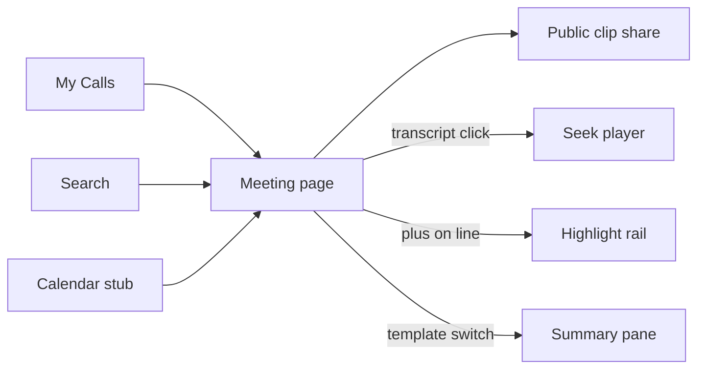

# Session Log - 2026-09-20

Session: `1297fe50` | Project: `8x-assignment` | Author: `ibrahimbutt`

---

[LOG_ENTRY type=PROMPT num=1 session=1297fe50]
timestamp: 2026-09-20T06:24:46.256Z
model: cursor-grok-4.6-high-fast

CAPTURE TEST — 8x assignment, Muhammad Ibrahim

[LOG_ENTRY type=RESPONSE num=1 session=1297fe50]
timestamp: 2026-09-20T06:25:04.417Z
model: cursor-grok-4.6-high-fast

**CAPTURE TEST PASS (session 1)** — Muhammad Ibrahim.

The prompt is in `.agent-logs/2026-09-20_06-24-46_1297fe50-7097-4685-92298de1488f.md` as:

```
[LOG_ENTRY type=PROMPT num=1 session=1297fe50]
timestamp: 2026-09-20T06:24:46.256Z
model: cursor-grok-4.6-high-fast

CAPTURE TEST — 8x assignment, Muhammad Ibrahim
```

This reply is the matching response. When the turn ends, `afterAgentResponse` / `stop` should append it automatically.

**Next:** open a **new** Agent chat in this same `8x-assignment` repo (not this thread) and send:

`CAPTURE TEST 2 — 8x assignment, Muhammad Ibrahim`

That proves the hook is not session-local. I will then write `CAPTURE-TEST.md` and commit the logs. No Fathom work until that second canary lands.

[LOG_ENTRY type=PROMPT num=2 session=1297fe50]
timestamp: 2026-09-20T06:25:28.376Z
model: cursor-grok-4.6-high-fast

Rebuild a live product in 24 hours. Better than the original if you want.
That window is deliberately generous and we do not expect you to use all of it. The clock is tracked, never enforced.

The product
fathom.video — the AI meeting notetaker.

Start by using it. Sign up on the free plan and go through the flows properly, every one of them, end to end. Take screenshots as you go. Understand the product fully before you write any code.

At minimum that means: connect a calendar, get the notetaker into a real meeting (a two-minute call with yourself on Zoom, Meet or Teams is enough), let it record, then live with what comes out the other side. Watch the playback against the transcript. Read the AI summary, switch templates, pull the action items. Highlight a moment mid-call and see where it lands. Search across meetings. Share a clip with someone who was not on the call. Then look at what happens on an eight-person call that runs an hour, because that is the case that actually matters.

You do not have to make the recording bot work. Faking or stubbing the capture layer is a legitimate call — say so in the walkthrough and spend the time on what you decided matters more.

Before you write anything
Run through this so your agent captures its prompts and responses into the repository: 8x agent capture setup

It takes about ten minutes. Do not start building until the capture test passes, and commit the `.agent-logs/` directory as you go rather than in one lump at the end.

What you hand in
A live link. Deployed and open, not a localhost recording.
A public repository. With `.agent-logs/` committed in it.
A walkthrough. Loom or anything similar, five minutes at most, camera on. Put it in the walkthrough field.
Paste the live link and the repository into the links field, and label each one.

Seed it with real data. An empty meetings list tells us nothing about what you built.

How it is judged
Speed. How much working product you got to in the time.
Product judgement. What you chose to build first, and what you left out.
UX and UI. Whether the thing you shipped is good to use.
Before you send it
The live link opens for somebody who is not signed in as you.
The repository is public, and `.agent-logs/` is in it.
Your camera is on in the walkthrough, and it is under five minutes.


we are going to build this website check it out and make a plan to match its requirements we have 15 hours to build and ship it

[LOG_ENTRY type=RESPONSE num=2 session=1297fe50]
timestamp: 2026-09-20T06:27:09.031Z
model: cursor-grok-4.6-high-fast

Session 1 capture is working and committed. I have not started product code.

I went through Fathom’s marketing site, overview, pricing, and help center (call page, highlights, clips, templates, sharing). I did **not** complete a live Zoom signup — that needs your Google/Zoom login. The assignment also says stubbing capture is a legitimate call, and that is the call I would make.

---

## What Fathom actually is (the product, not the homepage)

Fathom is not “a video player with notes.” The loop is:

1. A meeting exists (calendar / bot / bot-free).
2. After the call you live in **one page**: player + speaker-labeled transcript + summary + action items + highlights.
3. You **click the transcript to seek**, add a highlight from a line, and **share a clip** with someone who was not there.
4. You **search across meetings** and land on the exact utterance.
5. Templates change the summary (General, BANT, standup, etc.).

The brief is right: a two-minute self-call is the happy path. The thing that actually matters is an **eight-person, hour-long** call — overlapping speakers, many action items, highlights buried at minute 41.

## Judgement: what we build vs leave out

**Build (this is the product):**

| Flow | Why |
|---|---|
| Seeded **My Calls** home | Empty list fails the brief |
| Meeting page: player + transcript **in sync** | Core Fathom interaction |
| AI summary + **switch templates** (precomputed, instant) | Required; no API dependency for judges |
| Action items with owners | Required |
| Highlight a moment → it appears in the rail | Required |
| Search across meetings → jump to timestamp | Required |
| **Public share clip** (`/s/[id]`) — no login | Required, and satisfies “opens for somebody who is not signed in as you” |
| One **58–62 min, 8-speaker** meeting as the hero seed | The case they said matters |
| Calendar stub + fake “live” 2-min recording | Shows the capture story without a bot |

**Stub (say so in the walkthrough):** Zoom/Meet/Teams recording bot, real calendar OAuth, live notetaker in a real call.

**Leave out:** CRM sync, Scorecards, Deal View, playlists, folders, SSO, Ask-Fathom LLM chat, Slack/HubSpot, iOS/desktop, bot-free capture modes. Those are Fathom’s moat and they will eat the 15 hours.

**Auth:** none. The live site is a public demo workspace. Judges open the URL and see meetings. Share links work in a private window.

## Name and look

Not a Fathom clone with stars and astronauts. Working name: **Quorum**.

Visual direction: dark, dense, editorial — closer to a film-reviewer than a SaaS dashboard. Distinct type, tight meeting page, no purple-gradient AI look.

## Stack (ship in 15 hours)

- **Next.js (App Router) + TypeScript + Tailwind** in `/Users/muhammadsaqib/8x-assignment`
- Seed as committed TypeScript/JSON (no database)
- Highlights created in the demo persist in `localStorage`
- **Vercel** for the live link
- Public **GitHub** repo with `.agent-logs/` committed as we go

Player: waveform + duration. The hour-long call does **not** need a 60-minute video file — timestamps on the transcript are the product. A short 2-minute meeting can have a real audio file.



## 15-hour sequence

1. **Capture close-out (15–30 min)** — second-session canary + `CAPTURE-TEST.md`. Do this before UI code.
2. **Scaffold + design tokens (1.5h)**
3. **Seed 7 meetings (2h)** including the 8-person hour call, a 2-min 1:1, a sales discovery (BANT summary), a standup, a customer call. Precompute 3 templates per meeting.
4. **Home + search (1.5h)**
5. **Meeting page (3h)** — the whole grade lives here
6. **Templates + action items (1.5h)**
7. **Highlights + public clip page (2h)**
8. **Calendar stub + fake live capture (1h)**
9. **Polish + mobile (1h)**
10. **GitHub public + Vercel (45 min)**
11. **Walkthrough script for your 5-min camera-on Loom (30 min)** — I cannot turn your camera on; you record that last.

## Honest gaps from this recon

- I used fathom.ai / help.fathom.video, not a logged-in My Calls account.
- If you want, we can still sign up on the free plan with your Google account before coding. It would improve fidelity; it is not required to ship, given the stub-capture allowance.

---

**Still blocking the build:** open a **new** Agent chat in this same repo and send:

`CAPTURE TEST 2 — 8x assignment, Muhammad Ibrahim`

Then say **go** (or tweak the plan: name, auth, real Fathom signup). I will not write product code until that second canary lands and `CAPTURE-TEST.md` is in the repo.

[LOG_ENTRY type=PROMPT num=3 session=1297fe50]
timestamp: 2026-09-20T06:28:34.579Z
model: cursor-grok-4.6-high-fast

[LOG_ENTRY type=PROMPT num=1 session=baf18b67]
timestamp: 2026-09-20T06:27:32.475Z
model: cursor-grok-4.6-high-fast

CAPTURE TEST 2 — 8x assignment, Muhammad Ibrahim

[LOG_ENTRY type=RESPONSE num=3 session=1297fe50]
timestamp: 2026-09-20T06:29:14.921Z
model: cursor-grok-4.6-high-fast

**Capture test is green.** Session 2 is a separate conversation (`baf18b67`), not a continuation of this one.

| Session | File | Prompt | Response |
|---|---|---|---|
| 1 `1297fe50` | `.agent-logs/2026-09-20_06-24-46_1297fe50-7097-4685-9795-92298de1488f.md` | `CAPTURE TEST — 8x assignment, Muhammad Ibrahim` | landed |
| 2 `baf18b67` | `.agent-logs/2026-09-20_06-27-32_baf18b67-9efe-4523-9690-9b1a77148aaf.md` | `CAPTURE TEST 2 — 8x assignment, Muhammad Ibrahim` | landed |

`CAPTURE-TEST.md` is in the repo root with tool/model, hook config, both raw canary entries, and the first failure (`loop_limit: 0` made Cursor reject `hooks.json`). Committed as `f4ed722`.

Product code has not started. Say **go** to begin the Fathom rebuild from the plan.

[LOG_ENTRY type=PROMPT num=4 session=1297fe50]
timestamp: 2026-09-20T06:29:45.870Z
model: cursor-grok-4.6-high-fast

go

[LOG_ENTRY type=PROMPT num=5 session=1297fe50]
timestamp: 2026-09-20T06:50:07.190Z
model: cursor-grok-4.6-high-fast

You are my senior full-stack engineer, product engineer, UI/UX designer, and technical lead.

I am completing a time-limited software engineering assignment from 8x Careers.

I have approximately 15 HOURS to build, polish, deploy, test, and submit this project.

Your job is to autonomously build the strongest possible submission within that time.

Do NOT repeatedly ask me what to build next.

Do NOT wait for me after every step.

Inspect the repository, make reasonable engineering decisions, implement the product, test it, fix problems, and continue.

When something is unavailable, create a sensible fallback and continue.

============================================================
1. ASSIGNMENT
============================================================

The assignment is:

"Clone: Fanthom AI"

For:

Software Engineer

The product to rebuild is:

https://fathom.video/

The assignment asks me to rebuild a live product in 24 hours.

I am intentionally targeting approximately 15 hours.

The assignment specifically says the evaluator wants the candidate to use the original product first and understand:

- calendar connection
- meeting capture
- recording
- playback
- transcript
- AI summary
- summary templates
- action items
- highlights
- search across meetings
- sharing a clip
- a larger meeting scenario such as an 8-person, approximately 1-hour meeting

IMPORTANT:

The assignment explicitly states:

"You do not have to make the recording bot work. Faking or stubbing the capture layer is a legitimate call — say so in the walkthrough and spend the time on what you decided matters more."

Therefore:

DO NOT waste the 15-hour budget trying to build an actual Zoom/Google Meet/Microsoft Teams recording bot.

Build an excellent simulated capture layer and spend the majority of the time on:

- product UX
- meeting experience
- transcript
- AI summary
- action items
- highlights
- search
- sharing
- realistic data
- polished UI
- deployment

============================================================
2. REFERENCE PRODUCT
============================================================

Reference:

https://fathom.video/

Before coding:

Inspect the reference product if browser/web access is available.

Understand its:

- navigation
- dashboard
- meeting list
- meeting detail
- transcript
- playback
- summaries
- action items
- highlights
- search
- sharing
- calendar/integrations
- settings
- meeting templates
- overall visual hierarchy

Do NOT copy proprietary source code or assets.

Use the reference as product inspiration.

Build our own implementation.

The final product should feel inspired by a premium AI meeting product, not like a literal source-code clone.

============================================================
3. 8X AGENT CAPTURE REQUIREMENT
============================================================

The assignment requires this setup:

https://8x-internal.com/p/8x-agent-capture-setup

The assignment says:

"Run through this so your agent captures its prompts and responses into the repository."

It also says:

"Do not start building until the capture test passes, and commit the .agent-logs/ directory as you go rather than in one lump at the end."

Before implementation:

1. Inspect the current repository.
2. Check whether .agent-logs already exists.
3. Check whether agent capture is configured.
4. Follow the available setup instructions if possible.
5. Verify the capture test if the environment allows it.

IMPORTANT:

Never falsely claim that the capture test passed.

If there is a required manual action that only I can perform, tell me exactly what it is and then continue with everything else that can be automated.

Keep:

.agent-logs/

inside the repository.

Do NOT put secrets inside agent logs.

Do NOT delete the logs.

Commit .agent-logs as required.

============================================================
4. FIRST ACTION
============================================================

Before changing code:

INSPECT THE REPOSITORY.

Check:

- package.json
- existing framework
- existing routes
- existing components
- existing database setup
- existing authentication
- existing environment variables
- existing assets
- existing styling system
- git status
- current branch
- existing deployment configuration

Do NOT unnecessarily rewrite an existing working project.

If the repository is empty, create the project using the fastest production-quality architecture.

============================================================
5. TECHNOLOGY
============================================================

Preferred stack:

- Next.js
- TypeScript
- Tailwind CSS
- shadcn/ui where useful
- Lucide icons
- Supabase
- PostgreSQL
- Supabase Auth
- Server Actions / API routes
- Gemini or another available LLM API for AI functionality

If the repository already uses a different reasonable stack, KEEP IT.

Do not rewrite the project simply because you prefer another framework.

Prioritize:

- speed
- stability
- clean architecture
- deployment
- excellent UI
- maintainability

Avoid unnecessary packages.

============================================================
6. AUTHENTICATION
============================================================

Implement REAL authentication.

Required:

- Sign up
- Login
- Logout
- Protected routes
- Session persistence
- User profile
- Basic onboarding

Preferred:

Supabase Auth.

Authentication method:

- Email/password

If Google OAuth is already configured or easy to configure, it can be added.

Do NOT waste hours configuring OAuth credentials.

The application must work with email/password.

Create:

/login

/signup

/onboarding

Authenticated application routes must be protected.

============================================================
7. PRODUCT CONCEPT
============================================================

Build a polished AI meeting workspace.

Core flow:

LANDING PAGE
    ↓
SIGN UP
    ↓
ONBOARDING
    ↓
CONNECT CALENDAR
    ↓
DASHBOARD
    ↓
MEETINGS
    ↓
OPEN MEETING
    ↓
PLAYBACK
    ↓
TRANSCRIPT
    ↓
AI SUMMARY
    ↓
ACTION ITEMS
    ↓
HIGHLIGHTS
    ↓
SEARCH
    ↓
SHARE CLIP

The application should feel like a real SaaS product.

It must NOT feel like a CRUD assignment.

============================================================
8. BRAND / PRODUCT NAME
============================================================

Do NOT call the product "Fathom".

Create an original name.

Use a professional AI-meeting-product name such as:

"Recall"
or
"Meetly"
or
"Notely"

Choose ONE and use it consistently throughout the application.

Do not use Fathom logos or proprietary branding.

============================================================
9. LANDING PAGE
============================================================

Create a polished SaaS landing page.

Hero:

Headline similar in concept to:

"Your meetings, remembered."

Supporting text:

"AI-powered meeting notes, transcripts, summaries, action items, and searchable conversations — automatically organized in one workspace."

Primary CTA:

"Get started free"

Secondary CTA:

"See how it works"

Include a beautiful product preview.

Sections:

- AI meeting summaries
- Searchable transcripts
- Action items
- Meeting highlights
- Ask your meetings
- Team collaboration
- Calendar integrations

Keep the landing page relatively concise.

The APPLICATION experience is more important than marketing-page complexity.

============================================================
10. UI/UX IS A TOP PRIORITY
============================================================

IMPORTANT:

The evaluator will judge:

- speed
- product judgement
- UX/UI

Therefore UI/UX quality is one of the highest priorities.

DO NOT build a generic dashboard.

DO NOT make it look like a default shadcn demo.

DO NOT make every section a huge card.

DO NOT use excessive gradients.

DO NOT use excessive glassmorphism.

DO NOT create unnecessary decorative elements.

The final product should feel like a professionally designed premium SaaS application.

Think like a senior product designer.

============================================================
11. DESIGN SYSTEM
============================================================

Create a consistent design system.

Use:

- modern typography
- excellent hierarchy
- clean neutral background
- refined blue/indigo accent
- subtle borders
- subtle shadows
- tasteful corner radius
- consistent spacing
- consistent icon sizing
- professional buttons
- polished inputs
- refined badges
- clean tables/lists
- beautiful empty states

Define consistent:

- font sizes
- font weights
- spacing
- colors
- border radius
- shadows
- button styles
- input styles
- cards
- tabs
- modals
- dropdowns
- badges
- avatars

Do not style every page independently.

The entire application should feel like one coherent product.

============================================================
12. UI QUALITY STANDARD
============================================================

Every screen should answer:

- What am I looking at?
- What is important?
- What should I do next?
- What happened?
- What requires my attention?

Within 3 seconds of opening a page, the user should understand its purpose.

Use visual hierarchy instead of simply adding more UI elements.

Use whitespace intentionally.

Avoid both:

- excessive empty space
- excessive information density

============================================================
13. APPLICATION SHELL
============================================================

Authenticated application:

LEFT SIDEBAR:

- Overview
- My Meetings
- Shared with me
- Action Items
- Highlights
- Search
- Calendar
- Settings

Bottom:

- user avatar
- user name
- account menu
- logout

Top bar:

- global search
- notifications if useful
- user menu

Desktop:

Use a beautiful fixed/collapsible sidebar.

Mobile:

Use a proper mobile navigation.

Do NOT simply shrink desktop navigation.

============================================================
14. DASHBOARD
============================================================

Route:

/dashboard

Create a polished dashboard.

Header:

"Good morning, [Name]"

Show:

- upcoming meetings
- recent meetings
- action items
- highlights
- meetings captured
- time saved
- quick actions

Example:

UPCOMING

Product Strategy Sync
Today · 2:00 PM

Customer Discovery Call
Today · 4:30 PM

RECENT

Q3 Product Strategy
1 hour ago

Acme Customer Call
Yesterday

ACTION ITEMS

5 open

HIGHLIGHTS

12 saved

Make the dashboard visually balanced.

The user should immediately understand what needs attention.

============================================================
15. MEETINGS
============================================================

Route:

/meetings

Features:

- search
- date filter
- participant filter
- meeting type filter
- sorting
- recent meetings
- meeting cards/list

Each meeting should show:

- title
- date
- duration
- participants
- meeting type
- platform
- short summary
- action item count
- highlight count

Meeting examples:

- Q3 Product Strategy
- Acme Customer Call
- Engineering Weekly Sync
- Sales Discovery
- Product Design Review
- Candidate Interview
- Customer Success Review
- One-on-One
- Sprint Planning
- Leadership Sync

============================================================
16. IMPORTANT SHOWCASE MEETING
============================================================

Create one exceptional seeded meeting.

Title:

"Q3 Product Strategy"

Duration:

59:42

Participants:

8

Include:

- realistic business conversation
- multiple speakers
- timestamps
- questions
- interruptions
- decisions
- objections
- action items
- product discussions
- customer feedback
- pricing discussion
- risks
- next steps

The transcript must feel like a REAL business meeting.

DO NOT use lorem ipsum.

DO NOT use repetitive fake sentences.

The showcase meeting should demonstrate almost every product feature.

============================================================
17. MEETING DETAIL
============================================================

Route:

/meetings/[id]

This is the MOST IMPORTANT page.

Make it exceptional.

Header:

Meeting title

Date
Duration
Participants
Platform

Actions:

[Share]
[Export]
[More]

Main:

------------------------------------------------
VIDEO / AUDIO PLAYER
------------------------------------------------

Then:

[Overview]
[Transcript]
[Action Items]
[Highlights]

Or use an intelligent two-column layout on desktop.

The user should understand:

- what meeting this is
- who attended
- what happened
- what was decided
- what needs to happen next
- what moments matter

============================================================
18. PLAYBACK
============================================================

Real recording infrastructure is NOT required.

Create a polished simulated playback experience.

Controls:

- play/pause
- progress bar
- current time
- total time
- playback speed
- volume
- fullscreen if useful

The player should look realistic.

Transcript timestamps should synchronize with the player.

Clicking a transcript timestamp should update playback position.

Clicking a highlight should jump to that timestamp.

The player should have realistic meeting visuals.

============================================================
19. TRANSCRIPT
============================================================

Create a high-quality transcript viewer.

Example:

00:02

Sarah
Let's start with the Q3 product priorities.

00:17

David
The biggest issue we're seeing is onboarding.

00:42

Sarah
What are customers saying about the new flow?

Use:

- speaker names
- speaker avatars/initials
- timestamps
- readable spacing
- active transcript state
- hover state
- click-to-seek
- search
- highlight selection
- copy text

Do not display transcript as a giant wall of text.

Make it highly scannable.

============================================================
20. AI SUMMARY
============================================================

Create a beautiful summary panel.

Sections:

OVERVIEW

KEY TAKEAWAYS

DECISIONS

TOPICS DISCUSSED

NEXT STEPS

RISKS / CONCERNS

QUESTIONS

Example:

KEY TAKEAWAYS

• Activation improved after onboarding changes.
• Enterprise users still struggle with workspace permissions.
• The team agreed to prioritize the new onboarding experience.

DECISIONS

• Launch onboarding experiment next Tuesday.
• Add workspace permission audit logs.

Use concise, useful information.

Do not generate generic AI nonsense.

============================================================
21. SUMMARY TEMPLATES
============================================================

Implement a working template selector.

Templates:

- General
- Sales
- Customer Success
- Project Update
- One-on-One
- Interview
- Retrospective

Changing the template should change the summary content.

If AI API is available:

allow regeneration.

If AI API is unavailable:

use deterministic high-quality seeded summaries.

Never let the feature crash because an API key is missing.

============================================================
22. ACTION ITEMS
============================================================

Create real interactive action items.

Each item:

- title
- assignee
- due date
- status
- meeting
- timestamp

Statuses:

- Open
- In Progress
- Done

Allow:

- complete
- reopen
- change assignee
- change due date

Example:

○ Update onboarding proposal
Sarah
Due tomorrow

○ Review activation analytics
David
Due Friday

Use avatars, status indicators, and due-date badges.

Create:

/action-items

============================================================
23. HIGHLIGHTS
============================================================

Implement meeting highlights/key moments.

Each highlight:

- title
- timestamp
- excerpt
- meeting
- category
- creator

Examples:

Important customer objection

Pricing decision

Product commitment

Key insight

Users can:

- create highlight
- remove highlight
- open highlight
- jump to timestamp
- share highlight

Create:

/highlights

============================================================
24. SEARCH
============================================================

Search is a major feature.

Create:

/search

Search across:

- meeting titles
- transcript
- summaries
- participants
- action items
- highlights

Example:

pricing

Results:

Q3 Product Strategy
"Enterprise pricing discussion..."

Acme Customer Call
"Customer asked about pricing..."

Each result should show:

- type
- meeting
- participant
- timestamp
- excerpt

Highlight matching search terms.

Clicking a transcript result should open the meeting and jump to that timestamp.

Use PostgreSQL full-text search if practical.

Otherwise use reliable text filtering.

Do NOT waste hours building unnecessary vector infrastructure.

============================================================
25. ASK YOUR MEETINGS
============================================================

Create:

"Ask your meetings"

Example questions:

"What customers mentioned onboarding problems?"

"What pricing objections came up this month?"

"What decisions were made about the mobile app?"

"What action items are assigned to Sarah?"

If an AI API is available:

send relevant meeting context to the model.

If not:

return deterministic demo answers based on the seeded data.

The feature must still look and feel real.

============================================================
26. SHARE CLIP
============================================================

Implement:

"Share clip"

User selects:

Start:
12:32

End:
13:04

Title:
Important pricing discussion

Generate a share token.

Route:

/share/[token]

This page must be publicly accessible WITHOUT login.

Show:

- meeting title
- clip title
- playback UI
- transcript excerpt
- timestamp
- shared-by information

This directly demonstrates the assignment requirement:

"Share a clip with someone who was not on the call."

============================================================
27. CALENDAR
============================================================

Create:

/calendar

Show integrations:

Google Calendar
Microsoft Calendar

Create:

[Connect]

Because this is a 15-hour assignment:

DO NOT spend hours implementing production OAuth unless credentials already exist.

Create a convincing simulated connection flow.

Example:

Connect Google Calendar

↓

Connecting...

↓

Google Calendar connected

↓

Upcoming meetings appear.

Architect the code so real OAuth can replace the mock later.

============================================================
28. CAPTURE SIMULATION
============================================================

Create:

"Start capture"

Flow:

Preparing meeting...

Recording...

Transcribing...

Generating summary...

Complete.

Then create a meeting using seeded/generated data.

Show progress states.

Add a subtle note:

"Demo capture mode — recording infrastructure is simulated for this prototype."

This is intentional and allowed by the assignment.

============================================================
29. SETTINGS
============================================================

Route:

/settings

Sections:

PROFILE

- name
- email
- avatar

PREFERENCES

- timezone
- language
- default summary template
- default meeting type

RECORDING

- auto capture
- consent notification

INTEGRATIONS

- Google Calendar
- Microsoft Calendar
- Zoom
- Google Meet
- Microsoft Teams

NOTIFICATIONS

- summary notifications
- action item reminders

============================================================
30. DATABASE
============================================================

Use clean relational models.

Entities:

users
meetings
meeting_participants
transcript_segments
summaries
action_items
highlights
meeting_topics
shared_clips
calendar_events
meeting_types
summary_templates

Meeting:

id
user_id
title
description
meeting_type_id
started_at
ended_at
duration_seconds
platform
status
recording_url
created_at

Transcript:

id
meeting_id
speaker_id
speaker_name
timestamp_seconds
text

Summary:

id
meeting_id
template
overview
key_takeaways
decisions
topics
risks
questions

Action Item:

id
meeting_id
title
assignee
due_date
status
source_timestamp

Highlight:

id
meeting_id
title
timestamp_start
timestamp_end
excerpt
category

Shared Clip:

id
meeting_id
token
title
start_seconds
end_seconds
created_by
created_at

============================================================
31. SEED DATA
============================================================

THIS IS CRITICAL.

Never show an empty product.

Seed:

10+ meetings

8+ participants

20+ transcript segments

10+ action items

8+ highlights

multiple meeting types

multiple meeting platforms

at least one 60-minute / 8-person meeting

at least one sales call

at least one customer call

at least one engineering meeting

at least one product meeting

at least one interview

at least one one-on-one

Make the data interconnected.

The first logged-in user should immediately see useful data.

============================================================
32. RESPONSIVE DESIGN
============================================================

The application MUST work on:

- desktop
- laptop
- tablet
- mobile

Do NOT simply shrink desktop.

Mobile should have:

- proper navigation
- responsive meeting detail
- transcript below summary
- touch-friendly controls
- usable playback
- responsive modals
- mobile-friendly search

Test common screen sizes.

============================================================
33. MICRO INTERACTIONS
============================================================

Add subtle professional interactions:

- hover states
- button transitions
- card hover
- dropdown transitions
- modal transitions
- tab transitions
- checkbox completion
- toast notifications
- sidebar transitions
- playback interaction

Animations must be subtle.

Do NOT over-animate.

============================================================
34. LOADING STATES
============================================================

Never use "Loading..." everywhere.

Create skeleton states for:

- dashboard
- meeting cards
- transcript
- summary
- action items

Use smooth transitions.

============================================================
35. EMPTY STATES
============================================================

Never show ugly blank pages.

Example:

"No meetings yet"

"Connect your calendar or capture your first meeting."

Include an appropriate CTA.

============================================================
36. FORMS
============================================================

All forms must have:

- labels
- placeholders
- validation
- inline errors
- loading state
- success state
- sensible defaults

Do not make users guess what to enter.

============================================================
37. ACCESSIBILITY
============================================================

Use:

- semantic HTML
- keyboard navigation
- focus states
- accessible labels
- sufficient contrast
- buttons instead of clickable divs
- ARIA where necessary

Do not sacrifice accessibility for visual design.

============================================================
38. AI ARCHITECTURE
============================================================

Create reusable server-side AI functions:

generateMeetingSummary()

generateActionItems()

askMeetings()

If GEMINI_API_KEY exists:

use Gemini.

If another AI provider is already configured:

use it.

If no AI key exists:

use deterministic fallback content.

The application must never crash because an AI key is missing.

Keep API keys server-side.

Never expose secret keys to the browser.

============================================================
39. AUTHORIZATION
============================================================

Users must only be able to access their own private data.

Implement:

- user ownership checks
- server-side authorization
- protected routes
- input validation

Shared clips are intentionally public only when explicitly shared.

============================================================
40. COMPONENT ARCHITECTURE
============================================================

Create reusable components:

AppSidebar
MobileNav
Topbar
MeetingCard
MeetingList
MeetingFilters
MeetingPlayer
TranscriptViewer
TranscriptLine
SummaryPanel
SummaryTemplateSelector
ActionItem
ActionItemList
HighlightCard
HighlightList
SearchBar
SearchResults
ShareClipModal
CalendarCard
StatsCard
UserMenu
EmptyState
LoadingSkeleton

Avoid duplicated UI.

============================================================
41. ROUTES
============================================================

Implement:

/
 /login
 /signup
 /onboarding
 /dashboard
 /meetings
 /meetings/[id]
 /action-items
 /highlights
 /search
 /calendar
 /settings
 /share/[token]

Protect authenticated routes.

============================================================
42. ONBOARDING
============================================================

After signup:

STEP 1

Welcome

STEP 2

Connect calendar

STEP 3

Meeting preferences

STEP 4

Show upcoming meetings

STEP 5

Dashboard

Keep onboarding fast.

Do not create unnecessary steps.

============================================================
43. MEETING TYPES
============================================================

Types:

- Sales
- Customer Success
- Internal
- Product
- Engineering
- Interview
- One-on-One
- Project

Use meeting type in:

- meeting card
- meeting detail
- summary template
- filters

============================================================
44. PERFORMANCE
============================================================

Use:

- server components where appropriate
- client components only when needed
- optimized queries
- lazy loading where useful
- optimized images
- minimal dependencies

Do not over-engineer.

============================================================
45. SECURITY
============================================================

Never commit:

- passwords
- API keys
- service-role keys
- tokens
- secrets

Create:

.env.example

Example:

NEXT_PUBLIC_SUPABASE_URL=
NEXT_PUBLIC_SUPABASE_ANON_KEY=
SUPABASE_SERVICE_ROLE_KEY=
GEMINI_API_KEY=

Keep real secrets in environment variables.

============================================================
46. ERROR HANDLING
============================================================

Every important action needs:

- loading
- success
- error

Examples:

Login failed
Meeting failed to load
Summary generation failed
Share link failed
Action item update failed
Calendar connection failed

Use polished toast/error UI.

Do not silently fail.

============================================================
47. PRODUCT JUDGEMENT
============================================================

We only have approximately 15 hours.

Prioritize:

P0 — MUST HAVE

1. Authentication
2. Dashboard
3. Meetings
4. Meeting detail
5. Playback
6. Transcript
7. AI summary
8. Summary templates
9. Action items
10. Highlights
11. Search
12. Share clip
13. Seeded realistic data
14. Responsive UI
15. Deployment

P1 — SHOULD HAVE

16. Calendar mock
17. Ask Meetings
18. Capture simulation
19. Settings
20. Onboarding

P2 — ONLY IF TIME REMAINS

21. Advanced animations
22. Real calendar OAuth
23. Real video conferencing integration
24. Advanced semantic search
25. Team collaboration
26. Advanced analytics

If time becomes limited:

CUT P2.

DO NOT sacrifice the polish of P0.

============================================================
48. 15-HOUR EXECUTION PLAN
============================================================

HOUR 0–1

- inspect repository
- inspect architecture
- verify agent capture setup
- inspect reference product
- establish architecture

HOUR 1–3

- authentication
- database
- seed data
- application shell
- navigation
- routing

HOUR 3–6

- dashboard
- meetings page
- meeting detail
- player
- transcript

HOUR 6–8

- AI summary
- summary templates
- action items
- highlights

HOUR 8–10

- search
- Ask Meetings
- share clip

HOUR 10–11

- calendar
- capture simulation
- settings

HOUR 11–13

UI/UX POLISH PASS

Spend significant time here.

Improve:

- spacing
- typography
- colors
- hierarchy
- responsive layouts
- animations
- loading states
- empty states
- buttons
- cards
- transcript
- meeting detail
- dashboard

HOUR 13–14

- production testing
- bug fixes
- deployment
- authentication testing
- shared link testing
- mobile testing

HOUR 14–15

- GitHub cleanup
- README
- .agent-logs
- final QA
- walkthrough preparation

============================================================
49. UI/UX FINAL QUALITY PASS
============================================================

Before considering the application finished, inspect EVERY major page visually.

Check:

Landing
Login
Signup
Onboarding
Dashboard
Meetings
Meeting Detail
Search
Action Items
Highlights
Calendar
Settings
Share Clip

Fix:

- inconsistent spacing
- misalignment
- awkward wrapping
- tiny text
- oversized UI
- inconsistent buttons
- inconsistent radius
- poor mobile layout
- excessive whitespace
- visual clutter
- confusing hierarchy

Ask:

"Would a professional SaaS company ship this UI?"

If not, improve it.

The goal is:

FUNCTIONAL
+
ATTRACTIVE
+
INTUITIVE
+
POLISHED

============================================================
50. GITHUB README
============================================================

Create a professional README.

Include:

- product overview
- features
- tech stack
- architecture
- authentication
- database
- AI architecture
- capture architecture
- mocked functionality
- local setup
- environment variables
- deployment
- limitations
- product decisions

IMPORTANT:

Explicitly document:

"The meeting capture/recording layer is simulated for this assignment. This was an intentional product decision to prioritize the meeting intelligence and user experience within the available implementation time."

Do not claim real Zoom/Meet recording if it is not implemented.

============================================================
51. .ENV.EXAMPLE
============================================================

Create:

.env.example

Only variable names.

Never include real secrets.

============================================================
52. AGENT LOGS
============================================================

Keep:

.agent-logs/

in the repository.

Commit the logs according to the assignment requirement.

Do not delete them.

Do not commit secrets.

============================================================
53. FINAL QA
============================================================

Before finishing, test:

AUTH

[ ] signup
[ ] login
[ ] logout
[ ] protected routes
[ ] session persistence

DASHBOARD

[ ] seeded meetings
[ ] upcoming meetings
[ ] action items
[ ] highlights
[ ] stats

MEETINGS

[ ] search
[ ] filters
[ ] meeting cards
[ ] meeting detail

MEETING DETAIL

[ ] player
[ ] transcript
[ ] timestamp seeking
[ ] summary
[ ] templates
[ ] action items
[ ] highlights

SEARCH

[ ] search meetings
[ ] search transcript
[ ] search participants
[ ] click result
[ ] jump to timestamp

SHARING

[ ] create clip
[ ] copy link
[ ] open public link without login

CALENDAR

[ ] connection simulation
[ ] upcoming meetings

CAPTURE

[ ] start capture
[ ] progress states
[ ] completion
[ ] meeting created

RESPONSIVE

[ ] desktop
[ ] laptop
[ ] tablet
[ ] mobile

DEPLOYMENT

[ ] HTTPS
[ ] public URL
[ ] no broken routes
[ ] no critical console errors
[ ] environment variables correct
[ ] no secrets committed

REPOSITORY

[ ] public GitHub
[ ] README
[ ] .agent-logs
[ ] .env.example
[ ] clean project

============================================================
54. IMPORTANT — DO NOT FAKE REAL FUNCTIONALITY
============================================================

Never claim something is implemented when it is not.

If recording is simulated:

SAY SO.

If calendar connection is simulated:

SAY SO.

If AI fallback is being used:

SAY SO.

The goal is to demonstrate strong engineering judgment.

The assignment explicitly allows the recording layer to be mocked.

============================================================
55. WALKTHROUGH OPTIMIZATION
============================================================

The final product should be designed around a strong 5-minute walkthrough.

Recommended flow:

0:00–0:30

Login/onboarding

0:30–1:00

Dashboard

1:00–1:30

Meeting list

1:30–2:40

Open the 8-person 60-minute meeting

Show:

- participants
- playback
- transcript
- timestamp seeking

2:40–3:25

Show:

- AI summary
- key takeaways
- decisions
- template switching

3:25–4:00

Show:

- action items
- highlight creation
- highlight playback

4:00–4:30

Search:

"pricing"

Show cross-meeting results.

4:30–5:00

Create/share a clip.

Briefly explain:

"The capture layer is intentionally simulated. I prioritized the meeting intelligence and product experience."

============================================================
56. FINAL RESPONSE
============================================================

When you finish development, report:

PROJECT NAME:

WHAT WAS BUILT:

TECH STACK:

AUTH:

DATABASE:

AI:

MEETING CAPTURE:

FEATURES COMPLETED:

FEATURES MOCKED:

LIVE URL:

GITHUB URL:

TEST ACCOUNT:

ENVIRONMENT VARIABLES:

KNOWN LIMITATIONS:

WALKTHROUGH PLAN:

FINAL QA:

Then provide a checklist:

[ ] Authentication
[ ] Dashboard
[ ] Meetings
[ ] 60-minute 8-person meeting
[ ] Playback
[ ] Transcript
[ ] AI Summary
[ ] Summary Templates
[ ] Action Items
[ ] Highlights
[ ] Search
[ ] Ask Meetings
[ ] Share Clip
[ ] Calendar
[ ] Capture Simulation
[ ] Responsive UI
[ ] Mobile UI
[ ] README
[ ] .agent-logs
[ ] Deployment
[ ] GitHub

============================================================
57. DEVELOPMENT BEHAVIOR
============================================================

MOST IMPORTANT:

WORK AUTONOMOUSLY.

Do not repeatedly ask me:

"What should I build next?"

Do not stop after creating a skeleton.

Do not build only static screenshots.

Do not leave buttons non-functional.

Do not create an empty dashboard.

Do not use lorem ipsum.

Do not spend hours on low-priority infrastructure.

Do not over-engineer.

Do not sacrifice UI quality for unnecessary backend complexity.

When a real external integration is unavailable:

CREATE A CLEAN MOCK/FALLBACK.

When an AI API is unavailable:

USE HIGH-QUALITY SEEDED FALLBACK CONTENT.

When recording infrastructure is unavailable:

USE THE SIMULATED CAPTURE FLOW.

Continue building.

============================================================
58. FINAL STANDARD
============================================================

The evaluator should open the live URL and immediately think:

"This feels like a real product."

Not:

"This is a coding assignment."

The product should demonstrate:

1. Strong engineering
2. Strong product judgement
3. Excellent UX
4. Attractive UI
5. Realistic data
6. Functional interactions
7. Thoughtful prioritization
8. A polished end-to-end meeting workflow

The application should be:

FAST
POLISHED
RESPONSIVE
INTUITIVE
PROFESSIONAL
DEMO-READY

START NOW.

FIRST:

1. Inspect the repository.
2. Inspect the existing environment.
3. Check the 8x agent capture setup.
4. Inspect the Fathom reference.
5. Create the implementation plan.
6. Start implementing immediately.

DO NOT WAIT FOR ME.

