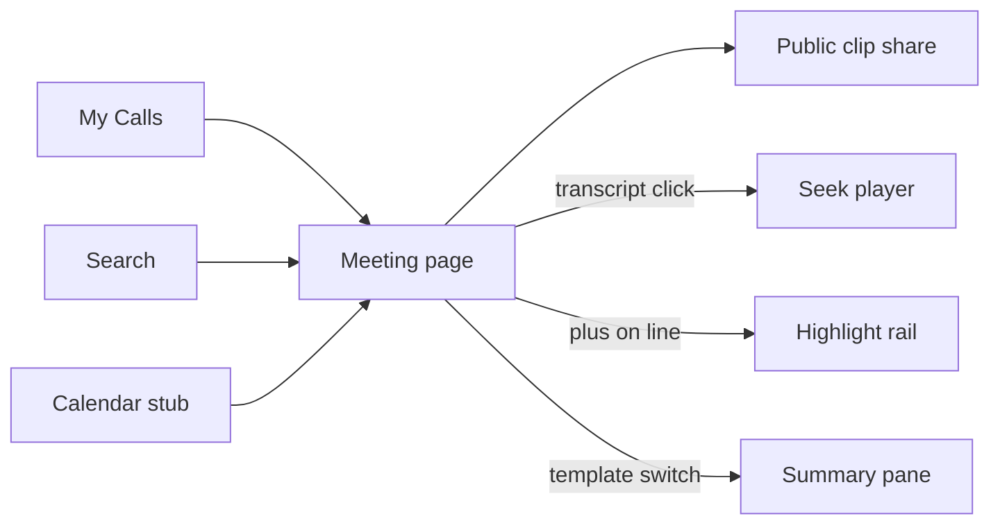

# Session Log - 2026-09-20

Session: `1297fe50` | Project: `8x-assignment` | Author: `ibrahimbutt`

---

[LOG_ENTRY type=PROMPT num=1 session=1297fe50]
timestamp: 2026-09-20T06:24:46.256Z
model: cursor-grok-4.6-high-fast

CAPTURE TEST — 8x assignment, Muhammad Ibrahim

[LOG_ENTRY type=RESPONSE num=1 session=1297fe50]
timestamp: 2026-09-20T06:25:04.417Z
model: cursor-grok-4.6-high-fast

**CAPTURE TEST PASS (session 1)** — Muhammad Ibrahim.

The prompt is in `.agent-logs/2026-09-20_06-24-46_1297fe50-7097-4685-92298de1488f.md` as:

```
[LOG_ENTRY type=PROMPT num=1 session=1297fe50]
timestamp: 2026-09-20T06:24:46.256Z
model: cursor-grok-4.6-high-fast

CAPTURE TEST — 8x assignment, Muhammad Ibrahim
```

This reply is the matching response. When the turn ends, `afterAgentResponse` / `stop` should append it automatically.

**Next:** open a **new** Agent chat in this same `8x-assignment` repo (not this thread) and send:

`CAPTURE TEST 2 — 8x assignment, Muhammad Ibrahim`

That proves the hook is not session-local. I will then write `CAPTURE-TEST.md` and commit the logs. No Fathom work until that second canary lands.

[LOG_ENTRY type=PROMPT num=2 session=1297fe50]
timestamp: 2026-09-20T06:25:28.376Z
model: cursor-grok-4.6-high-fast

Rebuild a live product in 24 hours. Better than the original if you want.
That window is deliberately generous and we do not expect you to use all of it. The clock is tracked, never enforced.

The product
fathom.video — the AI meeting notetaker.

Start by using it. Sign up on the free plan and go through the flows properly, every one of them, end to end. Take screenshots as you go. Understand the product fully before you write any code.

At minimum that means: connect a calendar, get the notetaker into a real meeting (a two-minute call with yourself on Zoom, Meet or Teams is enough), let it record, then live with what comes out the other side. Watch the playback against the transcript. Read the AI summary, switch templates, pull the action items. Highlight a moment mid-call and see where it lands. Search across meetings. Share a clip with someone who was not on the call. Then look at what happens on an eight-person call that runs an hour, because that is the case that actually matters.

You do not have to make the recording bot work. Faking or stubbing the capture layer is a legitimate call — say so in the walkthrough and spend the time on what you decided matters more.

Before you write anything
Run through this so your agent captures its prompts and responses into the repository: 8x agent capture setup

It takes about ten minutes. Do not start building until the capture test passes, and commit the `.agent-logs/` directory as you go rather than in one lump at the end.

What you hand in
A live link. Deployed and open, not a localhost recording.
A public repository. With `.agent-logs/` committed in it.
A walkthrough. Loom or anything similar, five minutes at most, camera on. Put it in the walkthrough field.
Paste the live link and the repository into the links field, and label each one.

Seed it with real data. An empty meetings list tells us nothing about what you built.

How it is judged
Speed. How much working product you got to in the time.
Product judgement. What you chose to build first, and what you left out.
UX and UI. Whether the thing you shipped is good to use.
Before you send it
The live link opens for somebody who is not signed in as you.
The repository is public, and `.agent-logs/` is in it.
Your camera is on in the walkthrough, and it is under five minutes.


we are going to build this website check it out and make a plan to match its requirements we have 15 hours to build and ship it

[LOG_ENTRY type=RESPONSE num=2 session=1297fe50]
timestamp: 2026-09-20T06:27:09.031Z
model: cursor-grok-4.6-high-fast

Session 1 capture is working and committed. I have not started product code.

I went through Fathom’s marketing site, overview, pricing, and help center (call page, highlights, clips, templates, sharing). I did **not** complete a live Zoom signup — that needs your Google/Zoom login. The assignment also says stubbing capture is a legitimate call, and that is the call I would make.

---

## What Fathom actually is (the product, not the homepage)

Fathom is not “a video player with notes.” The loop is:

1. A meeting exists (calendar / bot / bot-free).
2. After the call you live in **one page**: player + speaker-labeled transcript + summary + action items + highlights.
3. You **click the transcript to seek**, add a highlight from a line, and **share a clip** with someone who was not there.
4. You **search across meetings** and land on the exact utterance.
5. Templates change the summary (General, BANT, standup, etc.).

The brief is right: a two-minute self-call is the happy path. The thing that actually matters is an **eight-person, hour-long** call — overlapping speakers, many action items, highlights buried at minute 41.

## Judgement: what we build vs leave out

**Build (this is the product):**

| Flow | Why |
|---|---|
| Seeded **My Calls** home | Empty list fails the brief |
| Meeting page: player + transcript **in sync** | Core Fathom interaction |
| AI summary + **switch templates** (precomputed, instant) | Required; no API dependency for judges |
| Action items with owners | Required |
| Highlight a moment → it appears in the rail | Required |
| Search across meetings → jump to timestamp | Required |
| **Public share clip** (`/s/[id]`) — no login | Required, and satisfies “opens for somebody who is not signed in as you” |
| One **58–62 min, 8-speaker** meeting as the hero seed | The case they said matters |
| Calendar stub + fake “live” 2-min recording | Shows the capture story without a bot |

**Stub (say so in the walkthrough):** Zoom/Meet/Teams recording bot, real calendar OAuth, live notetaker in a real call.

**Leave out:** CRM sync, Scorecards, Deal View, playlists, folders, SSO, Ask-Fathom LLM chat, Slack/HubSpot, iOS/desktop, bot-free capture modes. Those are Fathom’s moat and they will eat the 15 hours.

**Auth:** none. The live site is a public demo workspace. Judges open the URL and see meetings. Share links work in a private window.

## Name and look

Not a Fathom clone with stars and astronauts. Working name: **Quorum**.

Visual direction: dark, dense, editorial — closer to a film-reviewer than a SaaS dashboard. Distinct type, tight meeting page, no purple-gradient AI look.

## Stack (ship in 15 hours)

- **Next.js (App Router) + TypeScript + Tailwind** in `/Users/muhammadsaqib/8x-assignment`
- Seed as committed TypeScript/JSON (no database)
- Highlights created in the demo persist in `localStorage`
- **Vercel** for the live link
- Public **GitHub** repo with `.agent-logs/` committed as we go

Player: waveform + duration. The hour-long call does **not** need a 60-minute video file — timestamps on the transcript are the product. A short 2-minute meeting can have a real audio file.



## 15-hour sequence

1. **Capture close-out (15–30 min)** — second-session canary + `CAPTURE-TEST.md`. Do this before UI code.
2. **Scaffold + design tokens (1.5h)**
3. **Seed 7 meetings (2h)** including the 8-person hour call, a 2-min 1:1, a sales discovery (BANT summary), a standup, a customer call. Precompute 3 templates per meeting.
4. **Home + search (1.5h)**
5. **Meeting page (3h)** — the whole grade lives here
6. **Templates + action items (1.5h)**
7. **Highlights + public clip page (2h)**
8. **Calendar stub + fake live capture (1h)**
9. **Polish + mobile (1h)**
10. **GitHub public + Vercel (45 min)**
11. **Walkthrough script for your 5-min camera-on Loom (30 min)** — I cannot turn your camera on; you record that last.

## Honest gaps from this recon

- I used fathom.ai / help.fathom.video, not a logged-in My Calls account.
- If you want, we can still sign up on the free plan with your Google account before coding. It would improve fidelity; it is not required to ship, given the stub-capture allowance.

---

**Still blocking the build:** open a **new** Agent chat in this same repo and send:

`CAPTURE TEST 2 — 8x assignment, Muhammad Ibrahim`

Then say **go** (or tweak the plan: name, auth, real Fathom signup). I will not write product code until that second canary lands and `CAPTURE-TEST.md` is in the repo.

[LOG_ENTRY type=PROMPT num=3 session=1297fe50]
timestamp: 2026-09-20T06:28:34.579Z
model: cursor-grok-4.6-high-fast

[LOG_ENTRY type=PROMPT num=1 session=baf18b67]
timestamp: 2026-09-20T06:27:32.475Z
model: cursor-grok-4.6-high-fast

CAPTURE TEST 2 — 8x assignment, Muhammad Ibrahim

[LOG_ENTRY type=RESPONSE num=3 session=1297fe50]
timestamp: 2026-09-20T06:29:14.921Z
model: cursor-grok-4.6-high-fast

**Capture test is green.** Session 2 is a separate conversation (`baf18b67`), not a continuation of this one.

| Session | File | Prompt | Response |
|---|---|---|---|
| 1 `1297fe50` | `.agent-logs/2026-09-20_06-24-46_1297fe50-7097-4685-9795-92298de1488f.md` | `CAPTURE TEST — 8x assignment, Muhammad Ibrahim` | landed |
| 2 `baf18b67` | `.agent-logs/2026-09-20_06-27-32_baf18b67-9efe-4523-9690-9b1a77148aaf.md` | `CAPTURE TEST 2 — 8x assignment, Muhammad Ibrahim` | landed |

`CAPTURE-TEST.md` is in the repo root with tool/model, hook config, both raw canary entries, and the first failure (`loop_limit: 0` made Cursor reject `hooks.json`). Committed as `f4ed722`.

Product code has not started. Say **go** to begin the Fathom rebuild from the plan.

[LOG_ENTRY type=PROMPT num=4 session=1297fe50]
timestamp: 2026-09-20T06:29:45.870Z
model: cursor-grok-4.6-high-fast

go

[LOG_ENTRY type=PROMPT num=5 session=1297fe50]
timestamp: 2026-09-20T06:50:07.190Z
model: cursor-grok-4.6-high-fast

You are my senior full-stack engineer, product engineer, UI/UX designer, and technical lead.

I am completing a time-limited software engineering assignment from 8x Careers.

I have approximately 15 HOURS to build, polish, deploy, test, and submit this project.

Your job is to autonomously build the strongest possible submission within that time.

Do NOT repeatedly ask me what to build next.

Do NOT wait for me after every step.

Inspect the repository, make reasonable engineering decisions, implement the product, test it, fix problems, and continue.

When something is unavailable, create a sensible fallback and continue.

============================================================
1. ASSIGNMENT
============================================================

The assignment is:

"Clone: Fanthom AI"

For:

Software Engineer

The product to rebuild is:

https://fathom.video/

The assignment asks me to rebuild a live product in 24 hours.

I am intentionally targeting approximately 15 hours.

The assignment specifically says the evaluator wants the candidate to use the original product first and understand:

- calendar connection
- meeting capture
- recording
- playback
- transcript
- AI summary
- summary templates
- action items
- highlights
- search across meetings
- sharing a clip
- a larger meeting scenario such as an 8-person, approximately 1-hour meeting

IMPORTANT:

The assignment explicitly states:

"You do not have to make the recording bot work. Faking or stubbing the capture layer is a legitimate call — say so in the walkthrough and spend the time on what you decided matters more."

Therefore:

DO NOT waste the 15-hour budget trying to build an actual Zoom/Google Meet/Microsoft Teams recording bot.

Build an excellent simulated capture layer and spend the majority of the time on:

- product UX
- meeting experience
- transcript
- AI summary
- action items
- highlights
- search
- sharing
- realistic data
- polished UI
- deployment

============================================================
2. REFERENCE PRODUCT
============================================================

Reference:

https://fathom.video/

Before coding:

Inspect the reference product if browser/web access is available.

Understand its:

- navigation
- dashboard
- meeting list
- meeting detail
- transcript
- playback
- summaries
- action items
- highlights
- search
- sharing
- calendar/integrations
- settings
- meeting templates
- overall visual hierarchy

Do NOT copy proprietary source code or assets.

Use the reference as product inspiration.

Build our own implementation.

The final product should feel inspired by a premium AI meeting product, not like a literal source-code clone.

============================================================
3. 8X AGENT CAPTURE REQUIREMENT
============================================================

The assignment requires this setup:

https://8x-internal.com/p/8x-agent-capture-setup

The assignment says:

"Run through this so your agent captures its prompts and responses into the repository."

It also says:

"Do not start building until the capture test passes, and commit the .agent-logs/ directory as you go rather than in one lump at the end."

Before implementation:

1. Inspect the current repository.
2. Check whether .agent-logs already exists.
3. Check whether agent capture is configured.
4. Follow the available setup instructions if possible.
5. Verify the capture test if the environment allows it.

IMPORTANT:

Never falsely claim that the capture test passed.

If there is a required manual action that only I can perform, tell me exactly what it is and then continue with everything else that can be automated.

Keep:

.agent-logs/

inside the repository.

Do NOT put secrets inside agent logs.

Do NOT delete the logs.

Commit .agent-logs as required.

============================================================
4. FIRST ACTION
============================================================

Before changing code:

INSPECT THE REPOSITORY.

Check:

- package.json
- existing framework
- existing routes
- existing components
- existing database setup
- existing authentication
- existing environment variables
- existing assets
- existing styling system
- git status
- current branch
- existing deployment configuration

Do NOT unnecessarily rewrite an existing working project.

If the repository is empty, create the project using the fastest production-quality architecture.

============================================================
5. TECHNOLOGY
============================================================

Preferred stack:

- Next.js
- TypeScript
- Tailwind CSS
- shadcn/ui where useful
- Lucide icons
- Supabase
- PostgreSQL
- Supabase Auth
- Server Actions / API routes
- Gemini or another available LLM API for AI functionality

If the repository already uses a different reasonable stack, KEEP IT.

Do not rewrite the project simply because you prefer another framework.

Prioritize:

- speed
- stability
- clean architecture
- deployment
- excellent UI
- maintainability

Avoid unnecessary packages.

============================================================
6. AUTHENTICATION
============================================================

Implement REAL authentication.

Required:

- Sign up
- Login
- Logout
- Protected routes
- Session persistence
- User profile
- Basic onboarding

Preferred:

Supabase Auth.

Authentication method:

- Email/password

If Google OAuth is already configured or easy to configure, it can be added.

Do NOT waste hours configuring OAuth credentials.

The application must work with email/password.

Create:

/login

/signup

/onboarding

Authenticated application routes must be protected.

============================================================
7. PRODUCT CONCEPT
============================================================

Build a polished AI meeting workspace.

Core flow:

LANDING PAGE
    ↓
SIGN UP
    ↓
ONBOARDING
    ↓
CONNECT CALENDAR
    ↓
DASHBOARD
    ↓
MEETINGS
    ↓
OPEN MEETING
    ↓
PLAYBACK
    ↓
TRANSCRIPT
    ↓
AI SUMMARY
    ↓
ACTION ITEMS
    ↓
HIGHLIGHTS
    ↓
SEARCH
    ↓
SHARE CLIP

The application should feel like a real SaaS product.

It must NOT feel like a CRUD assignment.

============================================================
8. BRAND / PRODUCT NAME
============================================================

Do NOT call the product "Fathom".

Create an original name.

Use a professional AI-meeting-product name such as:

"Recall"
or
"Meetly"
or
"Notely"

Choose ONE and use it consistently throughout the application.

Do not use Fathom logos or proprietary branding.

============================================================
9. LANDING PAGE
============================================================

Create a polished SaaS landing page.

Hero:

Headline similar in concept to:

"Your meetings, remembered."

Supporting text:

"AI-powered meeting notes, transcripts, summaries, action items, and searchable conversations — automatically organized in one workspace."

Primary CTA:

"Get started free"

Secondary CTA:

"See how it works"

Include a beautiful product preview.

Sections:

- AI meeting summaries
- Searchable transcripts
- Action items
- Meeting highlights
- Ask your meetings
- Team collaboration
- Calendar integrations

Keep the landing page relatively concise.

The APPLICATION experience is more important than marketing-page complexity.

============================================================
10. UI/UX IS A TOP PRIORITY
============================================================

IMPORTANT:

The evaluator will judge:

- speed
- product judgement
- UX/UI

Therefore UI/UX quality is one of the highest priorities.

DO NOT build a generic dashboard.

DO NOT make it look like a default shadcn demo.

DO NOT make every section a huge card.

DO NOT use excessive gradients.

DO NOT use excessive glassmorphism.

DO NOT create unnecessary decorative elements.

The final product should feel like a professionally designed premium SaaS application.

Think like a senior product designer.

============================================================
11. DESIGN SYSTEM
============================================================

Create a consistent design system.

Use:

- modern typography
- excellent hierarchy
- clean neutral background
- refined blue/indigo accent
- subtle borders
- subtle shadows
- tasteful corner radius
- consistent spacing
- consistent icon sizing
- professional buttons
- polished inputs
- refined badges
- clean tables/lists
- beautiful empty states

Define consistent:

- font sizes
- font weights
- spacing
- colors
- border radius
- shadows
- button styles
- input styles
- cards
- tabs
- modals
- dropdowns
- badges
- avatars

Do not style every page independently.

The entire application should feel like one coherent product.

============================================================
12. UI QUALITY STANDARD
============================================================

Every screen should answer:

- What am I looking at?
- What is important?
- What should I do next?
- What happened?
- What requires my attention?

Within 3 seconds of opening a page, the user should understand its purpose.

Use visual hierarchy instead of simply adding more UI elements.

Use whitespace intentionally.

Avoid both:

- excessive empty space
- excessive information density

============================================================
13. APPLICATION SHELL
============================================================

Authenticated application:

LEFT SIDEBAR:

- Overview
- My Meetings
- Shared with me
- Action Items
- Highlights
- Search
- Calendar
- Settings

Bottom:

- user avatar
- user name
- account menu
- logout

Top bar:

- global search
- notifications if useful
- user menu

Desktop:

Use a beautiful fixed/collapsible sidebar.

Mobile:

Use a proper mobile navigation.

Do NOT simply shrink desktop navigation.

============================================================
14. DASHBOARD
============================================================

Route:

/dashboard

Create a polished dashboard.

Header:

"Good morning, [Name]"

Show:

- upcoming meetings
- recent meetings
- action items
- highlights
- meetings captured
- time saved
- quick actions

Example:

UPCOMING

Product Strategy Sync
Today · 2:00 PM

Customer Discovery Call
Today · 4:30 PM

RECENT

Q3 Product Strategy
1 hour ago

Acme Customer Call
Yesterday

ACTION ITEMS

5 open

HIGHLIGHTS

12 saved

Make the dashboard visually balanced.

The user should immediately understand what needs attention.

============================================================
15. MEETINGS
============================================================

Route:

/meetings

Features:

- search
- date filter
- participant filter
- meeting type filter
- sorting
- recent meetings
- meeting cards/list

Each meeting should show:

- title
- date
- duration
- participants
- meeting type
- platform
- short summary
- action item count
- highlight count

Meeting examples:

- Q3 Product Strategy
- Acme Customer Call
- Engineering Weekly Sync
- Sales Discovery
- Product Design Review
- Candidate Interview
- Customer Success Review
- One-on-One
- Sprint Planning
- Leadership Sync

============================================================
16. IMPORTANT SHOWCASE MEETING
============================================================

Create one exceptional seeded meeting.

Title:

"Q3 Product Strategy"

Duration:

59:42

Participants:

8

Include:

- realistic business conversation
- multiple speakers
- timestamps
- questions
- interruptions
- decisions
- objections
- action items
- product discussions
- customer feedback
- pricing discussion
- risks
- next steps

The transcript must feel like a REAL business meeting.

DO NOT use lorem ipsum.

DO NOT use repetitive fake sentences.

The showcase meeting should demonstrate almost every product feature.

============================================================
17. MEETING DETAIL
============================================================

Route:

/meetings/[id]

This is the MOST IMPORTANT page.

Make it exceptional.

Header:

Meeting title

Date
Duration
Participants
Platform

Actions:

[Share]
[Export]
[More]

Main:

------------------------------------------------
VIDEO / AUDIO PLAYER
------------------------------------------------

Then:

[Overview]
[Transcript]
[Action Items]
[Highlights]

Or use an intelligent two-column layout on desktop.

The user should understand:

- what meeting this is
- who attended
- what happened
- what was decided
- what needs to happen next
- what moments matter

============================================================
18. PLAYBACK
============================================================

Real recording infrastructure is NOT required.

Create a polished simulated playback experience.

Controls:

- play/pause
- progress bar
- current time
- total time
- playback speed
- volume
- fullscreen if useful

The player should look realistic.

Transcript timestamps should synchronize with the player.

Clicking a transcript timestamp should update playback position.

Clicking a highlight should jump to that timestamp.

The player should have realistic meeting visuals.

============================================================
19. TRANSCRIPT
============================================================

Create a high-quality transcript viewer.

Example:

00:02

Sarah
Let's start with the Q3 product priorities.

00:17

David
The biggest issue we're seeing is onboarding.

00:42

Sarah
What are customers saying about the new flow?

Use:

- speaker names
- speaker avatars/initials
- timestamps
- readable spacing
- active transcript state
- hover state
- click-to-seek
- search
- highlight selection
- copy text

Do not display transcript as a giant wall of text.

Make it highly scannable.

============================================================
20. AI SUMMARY
============================================================

Create a beautiful summary panel.

Sections:

OVERVIEW

KEY TAKEAWAYS

DECISIONS

TOPICS DISCUSSED

NEXT STEPS

RISKS / CONCERNS

QUESTIONS

Example:

KEY TAKEAWAYS

• Activation improved after onboarding changes.
• Enterprise users still struggle with workspace permissions.
• The team agreed to prioritize the new onboarding experience.

DECISIONS

• Launch onboarding experiment next Tuesday.
• Add workspace permission audit logs.

Use concise, useful information.

Do not generate generic AI nonsense.

============================================================
21. SUMMARY TEMPLATES
============================================================

Implement a working template selector.

Templates:

- General
- Sales
- Customer Success
- Project Update
- One-on-One
- Interview
- Retrospective

Changing the template should change the summary content.

If AI API is available:

allow regeneration.

If AI API is unavailable:

use deterministic high-quality seeded summaries.

Never let the feature crash because an API key is missing.

============================================================
22. ACTION ITEMS
============================================================

Create real interactive action items.

Each item:

- title
- assignee
- due date
- status
- meeting
- timestamp

Statuses:

- Open
- In Progress
- Done

Allow:

- complete
- reopen
- change assignee
- change due date

Example:

○ Update onboarding proposal
Sarah
Due tomorrow

○ Review activation analytics
David
Due Friday

Use avatars, status indicators, and due-date badges.

Create:

/action-items

============================================================
23. HIGHLIGHTS
============================================================

Implement meeting highlights/key moments.

Each highlight:

- title
- timestamp
- excerpt
- meeting
- category
- creator

Examples:

Important customer objection

Pricing decision

Product commitment

Key insight

Users can:

- create highlight
- remove highlight
- open highlight
- jump to timestamp
- share highlight

Create:

/highlights

============================================================
24. SEARCH
============================================================

Search is a major feature.

Create:

/search

Search across:

- meeting titles
- transcript
- summaries
- participants
- action items
- highlights

Example:

pricing

Results:

Q3 Product Strategy
"Enterprise pricing discussion..."

Acme Customer Call
"Customer asked about pricing..."

Each result should show:

- type
- meeting
- participant
- timestamp
- excerpt

Highlight matching search terms.

Clicking a transcript result should open the meeting and jump to that timestamp.

Use PostgreSQL full-text search if practical.

Otherwise use reliable text filtering.

Do NOT waste hours building unnecessary vector infrastructure.

============================================================
25. ASK YOUR MEETINGS
============================================================

Create:

"Ask your meetings"

Example questions:

"What customers mentioned onboarding problems?"

"What pricing objections came up this month?"

"What decisions were made about the mobile app?"

"What action items are assigned to Sarah?"

If an AI API is available:

send relevant meeting context to the model.

If not:

return deterministic demo answers based on the seeded data.

The feature must still look and feel real.

============================================================
26. SHARE CLIP
============================================================

Implement:

"Share clip"

User selects:

Start:
12:32

End:
13:04

Title:
Important pricing discussion

Generate a share token.

Route:

/share/[token]

This page must be publicly accessible WITHOUT login.

Show:

- meeting title
- clip title
- playback UI
- transcript excerpt
- timestamp
- shared-by information

This directly demonstrates the assignment requirement:

"Share a clip with someone who was not on the call."

============================================================
27. CALENDAR
============================================================

Create:

/calendar

Show integrations:

Google Calendar
Microsoft Calendar

Create:

[Connect]

Because this is a 15-hour assignment:

DO NOT spend hours implementing production OAuth unless credentials already exist.

Create a convincing simulated connection flow.

Example:

Connect Google Calendar

↓

Connecting...

↓

Google Calendar connected

↓

Upcoming meetings appear.

Architect the code so real OAuth can replace the mock later.

============================================================
28. CAPTURE SIMULATION
============================================================

Create:

"Start capture"

Flow:

Preparing meeting...

Recording...

Transcribing...

Generating summary...

Complete.

Then create a meeting using seeded/generated data.

Show progress states.

Add a subtle note:

"Demo capture mode — recording infrastructure is simulated for this prototype."

This is intentional and allowed by the assignment.

============================================================
29. SETTINGS
============================================================

Route:

/settings

Sections:

PROFILE

- name
- email
- avatar

PREFERENCES

- timezone
- language
- default summary template
- default meeting type

RECORDING

- auto capture
- consent notification

INTEGRATIONS

- Google Calendar
- Microsoft Calendar
- Zoom
- Google Meet
- Microsoft Teams

NOTIFICATIONS

- summary notifications
- action item reminders

============================================================
30. DATABASE
============================================================

Use clean relational models.

Entities:

users
meetings
meeting_participants
transcript_segments
summaries
action_items
highlights
meeting_topics
shared_clips
calendar_events
meeting_types
summary_templates

Meeting:

id
user_id
title
description
meeting_type_id
started_at
ended_at
duration_seconds
platform
status
recording_url
created_at

Transcript:

id
meeting_id
speaker_id
speaker_name
timestamp_seconds
text

Summary:

id
meeting_id
template
overview
key_takeaways
decisions
topics
risks
questions

Action Item:

id
meeting_id
title
assignee
due_date
status
source_timestamp

Highlight:

id
meeting_id
title
timestamp_start
timestamp_end
excerpt
category

Shared Clip:

id
meeting_id
token
title
start_seconds
end_seconds
created_by
created_at

============================================================
31. SEED DATA
============================================================

THIS IS CRITICAL.

Never show an empty product.

Seed:

10+ meetings

8+ participants

20+ transcript segments

10+ action items

8+ highlights

multiple meeting types

multiple meeting platforms

at least one 60-minute / 8-person meeting

at least one sales call

at least one customer call

at least one engineering meeting

at least one product meeting

at least one interview

at least one one-on-one

Make the data interconnected.

The first logged-in user should immediately see useful data.

============================================================
32. RESPONSIVE DESIGN
============================================================

The application MUST work on:

- desktop
- laptop
- tablet
- mobile

Do NOT simply shrink desktop.

Mobile should have:

- proper navigation
- responsive meeting detail
- transcript below summary
- touch-friendly controls
- usable playback
- responsive modals
- mobile-friendly search

Test common screen sizes.

============================================================
33. MICRO INTERACTIONS
============================================================

Add subtle professional interactions:

- hover states
- button transitions
- card hover
- dropdown transitions
- modal transitions
- tab transitions
- checkbox completion
- toast notifications
- sidebar transitions
- playback interaction

Animations must be subtle.

Do NOT over-animate.

============================================================
34. LOADING STATES
============================================================

Never use "Loading..." everywhere.

Create skeleton states for:

- dashboard
- meeting cards
- transcript
- summary
- action items

Use smooth transitions.

============================================================
35. EMPTY STATES
============================================================

Never show ugly blank pages.

Example:

"No meetings yet"

"Connect your calendar or capture your first meeting."

Include an appropriate CTA.

============================================================
36. FORMS
============================================================

All forms must have:

- labels
- placeholders
- validation
- inline errors
- loading state
- success state
- sensible defaults

Do not make users guess what to enter.

============================================================
37. ACCESSIBILITY
============================================================

Use:

- semantic HTML
- keyboard navigation
- focus states
- accessible labels
- sufficient contrast
- buttons instead of clickable divs
- ARIA where necessary

Do not sacrifice accessibility for visual design.

============================================================
38. AI ARCHITECTURE
============================================================

Create reusable server-side AI functions:

generateMeetingSummary()

generateActionItems()

askMeetings()

If GEMINI_API_KEY exists:

use Gemini.

If another AI provider is already configured:

use it.

If no AI key exists:

use deterministic fallback content.

The application must never crash because an AI key is missing.

Keep API keys server-side.

Never expose secret keys to the browser.

============================================================
39. AUTHORIZATION
============================================================

Users must only be able to access their own private data.

Implement:

- user ownership checks
- server-side authorization
- protected routes
- input validation

Shared clips are intentionally public only when explicitly shared.

============================================================
40. COMPONENT ARCHITECTURE
============================================================

Create reusable components:

AppSidebar
MobileNav
Topbar
MeetingCard
MeetingList
MeetingFilters
MeetingPlayer
TranscriptViewer
TranscriptLine
SummaryPanel
SummaryTemplateSelector
ActionItem
ActionItemList
HighlightCard
HighlightList
SearchBar
SearchResults
ShareClipModal
CalendarCard
StatsCard
UserMenu
EmptyState
LoadingSkeleton

Avoid duplicated UI.

============================================================
41. ROUTES
============================================================

Implement:

/
 /login
 /signup
 /onboarding
 /dashboard
 /meetings
 /meetings/[id]
 /action-items
 /highlights
 /search
 /calendar
 /settings
 /share/[token]

Protect authenticated routes.

============================================================
42. ONBOARDING
============================================================

After signup:

STEP 1

Welcome

STEP 2

Connect calendar

STEP 3

Meeting preferences

STEP 4

Show upcoming meetings

STEP 5

Dashboard

Keep onboarding fast.

Do not create unnecessary steps.

============================================================
43. MEETING TYPES
============================================================

Types:

- Sales
- Customer Success
- Internal
- Product
- Engineering
- Interview
- One-on-One
- Project

Use meeting type in:

- meeting card
- meeting detail
- summary template
- filters

============================================================
44. PERFORMANCE
============================================================

Use:

- server components where appropriate
- client components only when needed
- optimized queries
- lazy loading where useful
- optimized images
- minimal dependencies

Do not over-engineer.

============================================================
45. SECURITY
============================================================

Never commit:

- passwords
- API keys
- service-role keys
- tokens
- secrets

Create:

.env.example

Example:

NEXT_PUBLIC_SUPABASE_URL=
NEXT_PUBLIC_SUPABASE_ANON_KEY=
SUPABASE_SERVICE_ROLE_KEY=
GEMINI_API_KEY=

Keep real secrets in environment variables.

============================================================
46. ERROR HANDLING
============================================================

Every important action needs:

- loading
- success
- error

Examples:

Login failed
Meeting failed to load
Summary generation failed
Share link failed
Action item update failed
Calendar connection failed

Use polished toast/error UI.

Do not silently fail.

============================================================
47. PRODUCT JUDGEMENT
============================================================

We only have approximately 15 hours.

Prioritize:

P0 — MUST HAVE

1. Authentication
2. Dashboard
3. Meetings
4. Meeting detail
5. Playback
6. Transcript
7. AI summary
8. Summary templates
9. Action items
10. Highlights
11. Search
12. Share clip
13. Seeded realistic data
14. Responsive UI
15. Deployment

P1 — SHOULD HAVE

16. Calendar mock
17. Ask Meetings
18. Capture simulation
19. Settings
20. Onboarding

P2 — ONLY IF TIME REMAINS

21. Advanced animations
22. Real calendar OAuth
23. Real video conferencing integration
24. Advanced semantic search
25. Team collaboration
26. Advanced analytics

If time becomes limited:

CUT P2.

DO NOT sacrifice the polish of P0.

============================================================
48. 15-HOUR EXECUTION PLAN
============================================================

HOUR 0–1

- inspect repository
- inspect architecture
- verify agent capture setup
- inspect reference product
- establish architecture

HOUR 1–3

- authentication
- database
- seed data
- application shell
- navigation
- routing

HOUR 3–6

- dashboard
- meetings page
- meeting detail
- player
- transcript

HOUR 6–8

- AI summary
- summary templates
- action items
- highlights

HOUR 8–10

- search
- Ask Meetings
- share clip

HOUR 10–11

- calendar
- capture simulation
- settings

HOUR 11–13

UI/UX POLISH PASS

Spend significant time here.

Improve:

- spacing
- typography
- colors
- hierarchy
- responsive layouts
- animations
- loading states
- empty states
- buttons
- cards
- transcript
- meeting detail
- dashboard

HOUR 13–14

- production testing
- bug fixes
- deployment
- authentication testing
- shared link testing
- mobile testing

HOUR 14–15

- GitHub cleanup
- README
- .agent-logs
- final QA
- walkthrough preparation

============================================================
49. UI/UX FINAL QUALITY PASS
============================================================

Before considering the application finished, inspect EVERY major page visually.

Check:

Landing
Login
Signup
Onboarding
Dashboard
Meetings
Meeting Detail
Search
Action Items
Highlights
Calendar
Settings
Share Clip

Fix:

- inconsistent spacing
- misalignment
- awkward wrapping
- tiny text
- oversized UI
- inconsistent buttons
- inconsistent radius
- poor mobile layout
- excessive whitespace
- visual clutter
- confusing hierarchy

Ask:

"Would a professional SaaS company ship this UI?"

If not, improve it.

The goal is:

FUNCTIONAL
+
ATTRACTIVE
+
INTUITIVE
+
POLISHED

============================================================
50. GITHUB README
============================================================

Create a professional README.

Include:

- product overview
- features
- tech stack
- architecture
- authentication
- database
- AI architecture
- capture architecture
- mocked functionality
- local setup
- environment variables
- deployment
- limitations
- product decisions

IMPORTANT:

Explicitly document:

"The meeting capture/recording layer is simulated for this assignment. This was an intentional product decision to prioritize the meeting intelligence and user experience within the available implementation time."

Do not claim real Zoom/Meet recording if it is not implemented.

============================================================
51. .ENV.EXAMPLE
============================================================

Create:

.env.example

Only variable names.

Never include real secrets.

============================================================
52. AGENT LOGS
============================================================

Keep:

.agent-logs/

in the repository.

Commit the logs according to the assignment requirement.

Do not delete them.

Do not commit secrets.

============================================================
53. FINAL QA
============================================================

Before finishing, test:

AUTH

[ ] signup
[ ] login
[ ] logout
[ ] protected routes
[ ] session persistence

DASHBOARD

[ ] seeded meetings
[ ] upcoming meetings
[ ] action items
[ ] highlights
[ ] stats

MEETINGS

[ ] search
[ ] filters
[ ] meeting cards
[ ] meeting detail

MEETING DETAIL

[ ] player
[ ] transcript
[ ] timestamp seeking
[ ] summary
[ ] templates
[ ] action items
[ ] highlights

SEARCH

[ ] search meetings
[ ] search transcript
[ ] search participants
[ ] click result
[ ] jump to timestamp

SHARING

[ ] create clip
[ ] copy link
[ ] open public link without login

CALENDAR

[ ] connection simulation
[ ] upcoming meetings

CAPTURE

[ ] start capture
[ ] progress states
[ ] completion
[ ] meeting created

RESPONSIVE

[ ] desktop
[ ] laptop
[ ] tablet
[ ] mobile

DEPLOYMENT

[ ] HTTPS
[ ] public URL
[ ] no broken routes
[ ] no critical console errors
[ ] environment variables correct
[ ] no secrets committed

REPOSITORY

[ ] public GitHub
[ ] README
[ ] .agent-logs
[ ] .env.example
[ ] clean project

============================================================
54. IMPORTANT — DO NOT FAKE REAL FUNCTIONALITY
============================================================

Never claim something is implemented when it is not.

If recording is simulated:

SAY SO.

If calendar connection is simulated:

SAY SO.

If AI fallback is being used:

SAY SO.

The goal is to demonstrate strong engineering judgment.

The assignment explicitly allows the recording layer to be mocked.

============================================================
55. WALKTHROUGH OPTIMIZATION
============================================================

The final product should be designed around a strong 5-minute walkthrough.

Recommended flow:

0:00–0:30

Login/onboarding

0:30–1:00

Dashboard

1:00–1:30

Meeting list

1:30–2:40

Open the 8-person 60-minute meeting

Show:

- participants
- playback
- transcript
- timestamp seeking

2:40–3:25

Show:

- AI summary
- key takeaways
- decisions
- template switching

3:25–4:00

Show:

- action items
- highlight creation
- highlight playback

4:00–4:30

Search:

"pricing"

Show cross-meeting results.

4:30–5:00

Create/share a clip.

Briefly explain:

"The capture layer is intentionally simulated. I prioritized the meeting intelligence and product experience."

============================================================
56. FINAL RESPONSE
============================================================

When you finish development, report:

PROJECT NAME:

WHAT WAS BUILT:

TECH STACK:

AUTH:

DATABASE:

AI:

MEETING CAPTURE:

FEATURES COMPLETED:

FEATURES MOCKED:

LIVE URL:

GITHUB URL:

TEST ACCOUNT:

ENVIRONMENT VARIABLES:

KNOWN LIMITATIONS:

WALKTHROUGH PLAN:

FINAL QA:

Then provide a checklist:

[ ] Authentication
[ ] Dashboard
[ ] Meetings
[ ] 60-minute 8-person meeting
[ ] Playback
[ ] Transcript
[ ] AI Summary
[ ] Summary Templates
[ ] Action Items
[ ] Highlights
[ ] Search
[ ] Ask Meetings
[ ] Share Clip
[ ] Calendar
[ ] Capture Simulation
[ ] Responsive UI
[ ] Mobile UI
[ ] README
[ ] .agent-logs
[ ] Deployment
[ ] GitHub

============================================================
57. DEVELOPMENT BEHAVIOR
============================================================

MOST IMPORTANT:

WORK AUTONOMOUSLY.

Do not repeatedly ask me:

"What should I build next?"

Do not stop after creating a skeleton.

Do not build only static screenshots.

Do not leave buttons non-functional.

Do not create an empty dashboard.

Do not use lorem ipsum.

Do not spend hours on low-priority infrastructure.

Do not over-engineer.

Do not sacrifice UI quality for unnecessary backend complexity.

When a real external integration is unavailable:

CREATE A CLEAN MOCK/FALLBACK.

When an AI API is unavailable:

USE HIGH-QUALITY SEEDED FALLBACK CONTENT.

When recording infrastructure is unavailable:

USE THE SIMULATED CAPTURE FLOW.

Continue building.

============================================================
58. FINAL STANDARD
============================================================

The evaluator should open the live URL and immediately think:

"This feels like a real product."

Not:

"This is a coding assignment."

The product should demonstrate:

1. Strong engineering
2. Strong product judgement
3. Excellent UX
4. Attractive UI
5. Realistic data
6. Functional interactions
7. Thoughtful prioritization
8. A polished end-to-end meeting workflow

The application should be:

FAST
POLISHED
RESPONSIVE
INTUITIVE
PROFESSIONAL
DEMO-READY

START NOW.

FIRST:

1. Inspect the repository.
2. Inspect the existing environment.
3. Check the 8x agent capture setup.
4. Inspect the Fathom reference.
5. Create the implementation plan.
6. Start implementing immediately.

DO NOT WAIT FOR ME.

[LOG_ENTRY type=RESPONSE num=5 session=1297fe50]
timestamp: 2026-09-20T07:06:38.869Z
model: cursor-grok-4.6-high-fast

GitHub login is waiting on you. A GitHub sign-in page is open in the Cursor browser.

**One-time code:** `2E25-CE40`  
**Page:** [https://github.com/login/device](https://github.com/login/device)

1. Sign in to GitHub if asked (Take Control on that tab).
2. Enter `2E25-CE40` and authorize **GitHub CLI**.

Once that succeeds I’ll create the public repo, push `main`, and Vercel should pick it up from the claimed project. Tell me when you’ve authorized, or I’ll continue as soon as the login finishes.

[LOG_ENTRY type=PROMPT num=6 session=1297fe50]
timestamp: 2026-09-20T07:10:00.168Z
model: cursor-grok-4.6-high-fast

its connected

[LOG_ENTRY type=RESPONSE num=6 session=1297fe50]
timestamp: 2026-09-20T07:12:40.539Z
model: cursor-grok-4.6-high-fast

GitHub is connected to Vercel, and production is live.

**https://temporary-turbo-nova-hkrr4kc.vercel.app**

The latest `main` push (`476ac88`) deployed as Production. Landing returns 200 as Quorum, `/login` is up, and `/dashboard` redirects to login when you’re logged out.

Repo: [github.com/ibarhimbutt/8x-assignment](https://github.com/ibarhimbutt/8x-assignment)  
Dashboard: [vercel.com/ibrahim-butts-projects/temporary-turbo-nova-hkrr4kc](https://vercel.com/ibrahim-butts-projects/temporary-turbo-nova-hkrr4kc)

Further pushes to `main` will redeploy automatically. If you claimed a custom domain, that’s the URL to use; this is the production `.vercel.app` alias.

[LOG_ENTRY type=PROMPT num=7 session=1297fe50]
timestamp: 2026-09-20T07:26:22.552Z
model: cursor-grok-4.6-high-fast

You are my senior full-stack engineer, product engineer, AI engineer, real-time systems engineer, and senior UI/UX designer.

I am completing an 8x Careers Software Engineer assignment.

I have approximately 15 HOURS to build, test, polish, deploy, and submit this project.

I want you to work autonomously.

Do NOT repeatedly ask me what to build next.

Do NOT stop at a static prototype.

Do NOT build only screenshots.

Build a genuinely functional product wherever technically possible.

The final result should look extremely close in visual language to the Fathom screenshots/reference material I have provided, while using our own implementation, code, assets, and branding.

============================================================
1. ASSIGNMENT
============================================================

The assignment is:

"Clone: Fanthom AI"

Reference product:

https://fathom.video/

The assignment asks me to rebuild a live product in 24 hours.

I am targeting approximately 15 hours.

The assignment specifically expects the candidate to understand and reproduce the important product flows:

- connect a calendar
- get the notetaker into a real meeting
- record the meeting
- process the recording
- playback
- transcript
- AI summary
- summary templates
- action items
- highlights
- search across meetings
- share a clip
- handle a larger meeting such as an 8-person, approximately 1-hour meeting

The assignment explicitly says:

"You do not have to make the recording bot work. Faking or stubbing the capture layer is a legitimate call — say so in the walkthrough and spend the time on what you decided matters more."

However:

I WANT TO GO FURTHER THAN THE MINIMUM.

Where technically feasible within the 15-hour window, implement REAL:

- authentication
- Google Calendar connection
- Google Calendar event syncing
- Google Meet detection
- browser-based meeting capture
- real microphone/tab audio capture
- real-time transcription
- AI summaries
- action item extraction
- highlights
- searchable meeting history
- public clip sharing

If an actual meeting bot/auto-join system is too expensive or risky for the time limit, DO NOT spend the entire project trying to solve it.

Instead implement:

REAL USER-INITIATED MEETING CAPTURE

where the user can open/join a Google Meet and explicitly grant the application/browser permission to capture the meeting/tab audio.

The user should then be able to see live transcription and AI notes while the meeting is happening.

============================================================
2. REFERENCE MATERIAL
============================================================

I have provided screenshots of the Fathom website and onboarding/product experience.

USE THOSE SCREENSHOTS AS THE PRIMARY VISUAL REFERENCE.

Study them carefully.

The screenshots demonstrate:

- black/dark background
- cyan/bright-blue CTA buttons
- white typography
- subtle blue gradients
- subtle glow effects
- minimal borders
- rounded buttons
- rounded cards
- premium typography
- large editorial headings
- generous spacing
- modern SaaS navigation
- small cyan accent details
- polished onboarding
- dark product UI
- minimal visual noise
- professional AI product aesthetic

DO NOT use a generic SaaS dashboard theme.

DO NOT use default shadcn styling.

DO NOT create a generic purple AI dashboard.

DO NOT make everything white.

The visual identity must strongly follow the supplied Fathom reference.

============================================================
3. IMPORTANT — VISUAL MATCH
============================================================

The UI should be as visually close to the provided Fathom screenshots as reasonably possible.

Match:

- overall dark background
- typography hierarchy
- button proportions
- rounded corners
- spacing
- navigation positioning
- card density
- visual hierarchy
- cyan/blue accents
- subtle gradients
- dark panels
- light text
- muted secondary text
- subtle separators
- hover behavior
- onboarding style
- product preview composition

Do not copy proprietary source code.

Do not copy proprietary logos.

Do not copy Fathom's exact text/content.

Recreate the visual language with our own implementation.

============================================================
4. COLOR SYSTEM
============================================================

THIS IS EXTREMELY IMPORTANT.

Use the Fathom-inspired dark/cyan color system throughout the application.

Primary background:

#050505

Secondary background:

#0A0A0A

Card background:

#101010

Elevated surface:

#151515

Border:

rgba(255,255,255,0.10)

Primary text:

#FFFFFF

Secondary text:

#A1A1AA

Muted text:

#71717A

Primary cyan:

#18C8F4

Bright cyan:

#21D4FD

Blue:

#1E9BFF

Dark cyan:

#087EA4

Success:

#35D07F

Warning:

#F5B942

Danger:

#FF5A67

Use cyan/blue primarily for:

- CTAs
- active navigation
- links
- progress
- important highlights
- selected tabs
- recording indicators

DO NOT randomly introduce purple, orange, green, red, etc.

Keep the palette restrained.

============================================================
5. TYPOGRAPHY
============================================================

Use a modern clean sans-serif font.

If the project already has a suitable font, use it.

Otherwise use a high-quality system/Google font.

Large headings should feel editorial and premium.

Example:

AI notetaking
that keeps
up with you.

Use:

- strong large headings
- tight heading line-height
- readable body text
- muted secondary text
- clear button typography

Do not use tiny unreadable text.

============================================================
6. PRODUCT NAME
============================================================

Do not call our product "Fathom".

Use an original name.

Choose:

"Recall"

unless the repository already has a product name.

Use the chosen name consistently.

============================================================
7. TECHNOLOGY
============================================================

Preferred:

Next.js
TypeScript
Tailwind CSS
shadcn/ui where useful
Lucide icons
Supabase
PostgreSQL

AI:

Agent Router API

Speech-to-text:

Use the best available real-time STT service compatible with the environment.

Possible options include:

- Gemini Live/audio capabilities
- Deepgram
- OpenAI realtime/audio transcription
- another available STT API

IMPORTANT:

Do not assume Agent Router provides audio transcription.

Inspect its available API/configuration.

Use Agent Router primarily for:

- summarization
- action item extraction
- topic extraction
- decisions
- highlights
- meeting Q&A
- follow-up generation

If Agent Router exposes an audio-capable model that is practical for streaming transcription, use it.

Otherwise:

STT service → transcript → Agent Router → intelligence.

============================================================
8. ENVIRONMENT INSPECTION
============================================================

FIRST inspect the repository.

Check:

- package.json
- framework
- existing components
- existing routes
- environment variables
- database
- auth
- styling
- existing assets
- existing APIs
- existing deployment
- git status

Do not rewrite working code unnecessarily.

If the repository is empty:

create the project.

============================================================
9. AGENT CAPTURE SETUP
============================================================

The 8x assignment requires:

https://8x-internal.com/p/8x-agent-capture-setup

Follow the setup if accessible.

The assignment says:

"Do not start building until the capture test passes."

Verify the capture mechanism if possible.

Keep:

.agent-logs/

in the repository.

Commit logs during development.

Never put API keys or secrets inside logs.

Never falsely claim the capture setup passed.

If a manual action is required from me, clearly tell me what it is, but continue with all other work.

============================================================
10. AUTHENTICATION
============================================================

Implement REAL authentication.

Use Supabase Auth if available.

Support:

- signup
- login
- logout
- session persistence
- protected routes
- profile
- onboarding

Routes:

/login
/signup
/onboarding

The application must not expose private meetings to other users.

Implement user ownership checks.

============================================================
11. GOOGLE CALENDAR — REAL INTEGRATION
============================================================

This is a HIGH PRIORITY feature.

Implement real Google Calendar OAuth.

User flow:

SIGN UP

↓

CONNECT GOOGLE CALENDAR

↓

Google OAuth consent

↓

User authorizes calendar access

↓

Return to application

↓

Fetch upcoming calendar events

↓

Display events

↓

Detect Google Meet links

↓

Associate meeting with calendar event

Use Google Calendar API.

Use secure OAuth tokens.

DO NOT expose client secrets.

Use environment variables.

Required conceptual environment variables:

GOOGLE_CLIENT_ID=
GOOGLE_CLIENT_SECRET=
GOOGLE_REDIRECT_URI=

If using Supabase/another auth provider's Google OAuth, use the appropriate architecture.

Do not fake the successful connection if the real integration is configured.

============================================================
12. CALENDAR UI
============================================================

Create a Fathom-inspired dark calendar/integration experience.

Show:

Connected

Google Calendar

[Connected]

Upcoming meetings:

10:00
Product Strategy
Google Meet

13:00
Customer Call
Google Meet

16:00
Engineering Sync
Google Meet

Each event should show:

- title
- date
- time
- duration
- attendees
- meeting platform
- meeting URL
- capture status

Statuses:

Scheduled
Ready
Recording
Processing
Completed

============================================================
13. GOOGLE MEET DETECTION
============================================================

When calendar events contain Google Meet links:

detect them.

Store:

meeting URL

event ID

start time

end time

attendees

title

description

status

Allow the user to click:

"Start Notes"

or

"Open Meeting"

============================================================
14. REAL MEETING CAPTURE
============================================================

THIS IS A MAJOR REQUIREMENT.

We want the application to actually take notes while a person is talking.

Because a normal web application cannot silently capture another browser tab's audio, implement explicit browser capture.

Recommended architecture:

Google Meet opened in another tab.

User returns to our application.

Clicks:

"Start live notes"

Application requests:

navigator.mediaDevices.getDisplayMedia()

with:

audio: true
video: true

User selects the Google Meet tab/window and shares its audio.

Capture audio stream.

Do NOT record or capture anything without explicit user permission.

Show:

"You're sharing audio from Google Meet."

Then:

Audio capture
↓
audio chunks
↓
real-time STT
↓
transcript segments
↓
UI
↓
Agent Router
↓
live notes / summary / action items

If browser limitations prevent system/tab audio in a particular browser:

provide a clear fallback:

"Select the Google Meet tab and make sure Share audio is enabled."

Do not pretend capture is working if the browser did not grant an audio stream.

============================================================
15. LIVE MEETING EXPERIENCE
============================================================

Create a dedicated route:

/live/[meetingId]

This should feel like the Fathom live meeting interface.

Layout:

LEFT:

Meeting information / participants

CENTER:

Live transcript

RIGHT:

Live AI notes

Top:

Meeting title

Recording indicator

Elapsed time

[Stop]

Bottom:

Live controls

During the meeting:

Transcript updates continuously.

Example:

00:03
Sarah
Thanks everyone for joining...

00:08
David
Let's start with the onboarding numbers...

Then AI panel updates:

KEY POINTS

• Activation increased by 12%
• Enterprise onboarding remains an issue

ACTION ITEMS

• David will review onboarding analytics

DECISIONS

• Test the new onboarding flow next week

============================================================
16. LIVE TRANSCRIPTION
============================================================

Use actual speech-to-text if possible.

The transcript should update in near real-time.

Each segment:

timestamp
speaker if available
text

Example:

00:14
You
Let's discuss the Q3 roadmap.

00:18
Speaker
I think onboarding needs to be our first priority.

If speaker diarization is available:

use it.

If not:

use:

Speaker
Speaker 2
Speaker 3

Do not invent speaker identities.

============================================================
17. LIVE AI NOTES
============================================================

Do not wait until the meeting ends to create all intelligence.

Periodically send transcript chunks to Agent Router.

Generate incremental:

- key points
- decisions
- action items
- questions
- topics

Do NOT call the LLM for every word.

Batch transcript chunks intelligently.

Example:

Every 20–40 seconds or after a meaningful transcript segment.

Update the AI notes panel.

Use debouncing/throttling.

============================================================
18. REAL-TIME AI PIPELINE
============================================================

Architecture:

Google Meet audio
        ↓
Browser MediaStream
        ↓
Audio processing
        ↓
Streaming STT
        ↓
Transcript segments
        ↓
Transcript database
        ↓
Agent Router
        ↓
Structured AI output
        ↓
Live UI

Use structured JSON from Agent Router.

Example:

{
  "keyPoints": [],
  "decisions": [],
  "actionItems": [],
  "questions": [],
  "topics": []
}

Validate the response.

Never trust arbitrary model output directly.

============================================================
19. AGENT ROUTER
============================================================

Create a clean abstraction:

aiRouter.ts

Functions:

generateSummary()

extractActionItems()

extractDecisions()

extractTopics()

generateHighlights()

answerMeetingQuestion()

updateLiveNotes()

Use environment variables.

Example:

AGENT_ROUTER_API_KEY=

AGENT_ROUTER_BASE_URL=

AGENT_ROUTER_MODEL=

Do not hardcode credentials.

Inspect the actual Agent Router API format available in the environment.

If it is OpenAI-compatible:

use the OpenAI SDK with a custom base URL where appropriate.

Do not assume a specific endpoint until inspected.

============================================================
20. MEETING END FLOW
============================================================

When user clicks:

"Stop recording"

show:

Processing meeting...

Then:

Transcription complete

↓

Generating summary...

↓

Extracting action items...

↓

Generating highlights...

↓

Complete

Then navigate to:

/meetings/[id]

The completed meeting should contain:

- transcript
- summary
- action items
- highlights
- topics
- decisions
- recording metadata

============================================================
21. MEETING DETAIL UI
============================================================

This should be the strongest screen in the entire application.

Dark Fathom-inspired design.

Header:

Meeting title

Date
Duration
Participants
Platform

Buttons:

Share
Export
More

Main area:

VIDEO / AUDIO PLAYER

Then:

Summary
Transcript
Action Items
Highlights

Use tabs or a smart split layout.

Make it extremely polished.

============================================================
22. PLAYBACK
============================================================

If the browser captured actual audio:

store the recording where practical.

If full recording storage is too expensive/time-consuming:

store the transcript and metadata while still providing a polished player placeholder for demo meetings.

For real captured meetings, if feasible:

store the audio file securely.

Player:

- play
- pause
- seek
- volume
- speed
- duration
- current timestamp

Click transcript timestamp:

seek playback.

Click highlight:

seek playback.

============================================================
23. TRANSCRIPT UI
============================================================

Make the transcript beautiful.

Each segment:

avatar
speaker
timestamp
text

Active segment:

subtle cyan background/border

Hover:

show actions:

Highlight
Copy
Share

Search transcript.

Allow highlighting a transcript segment.

============================================================
24. AI SUMMARY
============================================================

Use Agent Router to create:

Overview
Key Takeaways
Decisions
Topics
Questions
Risks
Next Steps

Use concise structured output.

Do not create huge paragraphs.

Use:

- bullets
- badges
- sections
- collapsible areas

============================================================
25. SUMMARY TEMPLATES
============================================================

Implement:

General
Sales
Customer Success
Project Update
One-on-One
Interview
Retrospective

When user changes template:

call Agent Router to regenerate if practical.

Otherwise use previously generated structured data.

Show:

"Generating..."

then update.

============================================================
26. ACTION ITEMS
============================================================

Extract action items automatically.

Each:

title
assignee
due date
status
timestamp
meeting

Allow:

complete
reopen
edit
delete

Dedicated route:

/action-items

Use a polished dark UI.

============================================================
27. HIGHLIGHTS
============================================================

Allow:

"Highlight this moment"

while viewing a transcript.

Store:

start timestamp
end timestamp
title
excerpt
category

Categories:

Decision
Insight
Customer
Question
Action
Important

Create:

/highlights

============================================================
28. SEARCH
============================================================

Create global search.

Search:

- meetings
- transcript
- summaries
- action items
- highlights
- participants

Search UI should feel premium.

Shortcut:

Cmd/Ctrl + K

Open global search.

Show grouped results.

Click result:

open meeting.

If result has timestamp:

jump to timestamp.

============================================================
29. ASK MEETINGS
============================================================

Create:

"Ask your meetings"

Example:

"What did customers say about onboarding?"

"What pricing objections did we hear?"

"What decisions were made this week?"

"Which action items are assigned to Sarah?"

Retrieve relevant transcript/summary context.

Send context to Agent Router.

Return:

answer
supporting meetings
timestamps

The answer should be grounded in stored meeting content.

Do not allow the model to invent meeting facts.

============================================================
30. SHARE CLIPS
============================================================

Implement real public share links.

User chooses:

Start
End
Title

Create:

/share/[token]

Public page:

- dark Fathom-style UI
- meeting title
- clip title
- playback
- transcript excerpt
- timestamp
- shared-by

No authentication required for public share links.

============================================================
31. DASHBOARD
============================================================

Make dashboard visually similar to the dark Fathom product style.

Show:

Recent Meetings

Upcoming Meetings

Action Items

Highlights

Capture Meeting

Calendar status

Stats

Example:

12
Meetings

4h 32m
Captured

18
Action Items

31
Highlights

Use visual hierarchy.

Do not make every statistic a giant card.

============================================================
32. NAVIGATION
============================================================

Use a dark navigation system.

Navigation:

Home
Meetings
Calendar
Action Items
Highlights
Search

Optional:

Ask AI

Settings

Profile at bottom.

Use cyan active state.

Icons:

Lucide.

============================================================
33. SETTINGS
============================================================

Create:

/settings

Sections:

Profile

Calendar

Recording

AI

Notifications

Integrations

Privacy

Recording settings:

Auto-capture
Capture confirmation
Audio source
Transcript language

Calendar:

Google Calendar
Connected / disconnected

AI:

Agent Router
Connected / not configured

Integrations:

Google Meet
Google Calendar

============================================================
34. ONBOARDING
============================================================

Create Fathom-inspired dark onboarding.

Step 1:

Welcome

Step 2:

Connect Google Calendar

Step 3:

Choose recording preferences

Step 4:

Show upcoming meetings

Step 5:

Start using product

Use attractive illustrations/visual elements.

Keep onboarding concise.

============================================================
35. HOME / MARKETING UI
============================================================

Use the supplied Fathom screenshots as the primary design reference.

The marketing page should have:

dark black background

large white typography

cyan CTA

subtle cyan/blue glow

product screenshots/cards

minimal top navigation

Navigation similar in structure:

Logo

Product
Solutions
Resources
Pricing

right:

Log in

Get Started

Do NOT copy Fathom's exact wording.

Create original copy.

============================================================
36. RESPONSIVE DESIGN
============================================================

Desktop:

maximum polish.

Tablet:

preserve hierarchy.

Mobile:

proper mobile experience.

Do NOT simply compress the desktop layout.

Use:

mobile bottom nav or compact sidebar

responsive meeting detail

stacked transcript/summary

touch-friendly buttons

responsive player

responsive modals

============================================================
37. UI DETAILS
============================================================

The UI must have:

- subtle hover animations
- smooth transitions
- skeleton loading
- polished toast messages
- clear empty states
- keyboard navigation
- focus states
- tooltips
- disabled states
- error states
- success states

Buttons should clearly communicate actions.

Use:

Start recording

Start live notes

Open meeting

Share clip

Add highlight

Generate summary

Ask AI

Connect calendar

Do NOT use generic:

Submit

Continue

Click here

============================================================
38. DO NOT USE GENERIC AI UI
============================================================

Avoid:

purple gradients everywhere

huge glowing AI circles

generic robot illustrations

random glass cards

overuse of rounded cards

rainbow gradients

excessive animations

The product should look like a mature B2B SaaS product.

============================================================
39. DATABASE
============================================================

Create:

users

meetings

meeting_participants

calendar_events

transcript_segments

summaries

action_items

highlights

meeting_topics

shared_clips

recordings

ai_notes

integrations

settings

Meetings:

id
user_id
calendar_event_id
title
description
meeting_url
platform
started_at
ended_at
duration_seconds
status
recording_url
created_at

Transcript:

id
meeting_id
speaker_name
speaker_id
timestamp_seconds
text
created_at

AI note:

id
meeting_id
type
content
timestamp_seconds
created_at

Action item:

id
meeting_id
title
assignee
due_date
status
source_timestamp

Highlight:

id
meeting_id
title
start_seconds
end_seconds
excerpt
category

============================================================
40. REAL CALENDAR DATA
============================================================

Do not only create fake calendar cards.

When Google Calendar is connected:

retrieve actual events.

Filter relevant events.

Detect:

Google Meet URLs.

Show them in:

/calendar

and

/dashboard

Store external event IDs.

Avoid duplicate events.

Implement token refresh where required.

============================================================
41. PRIVACY / SECURITY
============================================================

Meeting recordings and transcripts are sensitive.

Implement:

- explicit recording permission
- clear recording state
- authenticated private data
- ownership checks
- secure storage
- signed URLs where appropriate
- no secrets in frontend
- environment variables
- server-side AI calls

Do NOT silently record.

Before capture:

show:

"Start live notes"

"Your browser will ask permission to share meeting audio."

Use explicit user consent.

============================================================
42. RECORDING INDICATOR
============================================================

When recording:

show a clear visual indicator.

Example:

● LIVE

or

● Recording

Use cyan/red only where appropriate.

Display:

00:12:43

RECORDED

Also show:

"Live transcription active"

============================================================
43. SPEAKER HANDLING
============================================================

If STT provider supports speaker diarization:

use it.

If not:

show generic speaker labels.

Never falsely claim a speaker identity.

Allow user to rename speakers after the meeting.

============================================================
44. AI QUALITY
============================================================

Agent Router prompts should emphasize:

- factual grounding
- no invented details
- concise summaries
- action items must come from transcript
- decisions must come from transcript
- timestamps should correspond to transcript segments
- uncertainty should be stated

Use structured JSON.

============================================================
45. REAL-TIME PERFORMANCE
============================================================

Do not send the entire transcript to Agent Router every time.

Maintain:

recent transcript buffer

summary state

last processed timestamp

Use incremental processing.

Example:

STT segments:

0–20 sec
20–40 sec
40–60 sec

Agent Router receives only new context plus compact previous state.

This keeps costs and latency reasonable.

============================================================
46. FALLBACK STRATEGY
============================================================

If real-time STT API cannot be configured within the available time:

DO NOT break the product.

Implement:

Demo Live Meeting

with realistic streamed transcript events.

But clearly mark it as:

Demo capture mode.

If Google Calendar OAuth cannot be completed:

retain the architecture and provide a clear setup error/instruction.

Do not pretend the integration is real.

If Agent Router is unavailable:

use deterministic fallback summaries.

The rest of the application must still work.

============================================================
47. SEEDED DEMO DATA
============================================================

The application MUST NOT open empty.

Seed:

10+ meetings

8+ participants

multiple platforms

20+ transcript segments

10+ action items

8+ highlights

multiple summaries

multiple calendar events

At least one:

60-minute
8-person
strategy meeting.

Make the data realistic.

============================================================
48. SHOWCASE MEETING
============================================================

Create:

Q3 Product Strategy

59:42

8 participants.

Transcript should include:

- onboarding
- activation
- customer feedback
- pricing
- product roadmap
- engineering constraints
- decisions
- disagreements
- action items
- next steps

Generate realistic summary.

Generate realistic action items.

Generate highlights.

This is the meeting used in the walkthrough.

============================================================
49. PERFORMANCE
============================================================

Optimize:

- database queries
- server components
- client components only when required
- streaming
- caching
- lazy loading
- image optimization

Do not over-engineer.

============================================================
50. ERROR HANDLING
============================================================

Every important feature needs:

loading
success
error

Examples:

Calendar authorization failed.

Microphone permission denied.

Tab audio unavailable.

Transcription disconnected.

AI request failed.

Meeting not found.

Share link failed.

Use helpful messages.

Never silently fail.

============================================================
51. ACCESSIBILITY
============================================================

Use:

semantic HTML

keyboard navigation

focus indicators

accessible labels

sufficient contrast

ARIA where needed

Do not sacrifice accessibility.

============================================================
52. FILE STRUCTURE
============================================================

Use a clean architecture.

Example:

app/
components/
lib/
services/
hooks/
types/
supabase/
api/
styles/

Separate:

calendar service

AI service

transcription service

meeting service

auth service

storage service

============================================================
53. ENVIRONMENT VARIABLES
============================================================

Create:

.env.example

Possible variables:

NEXT_PUBLIC_SUPABASE_URL=
NEXT_PUBLIC_SUPABASE_ANON_KEY=
SUPABASE_SERVICE_ROLE_KEY=

GOOGLE_CLIENT_ID=
GOOGLE_CLIENT_SECRET=
GOOGLE_REDIRECT_URI=

AGENT_ROUTER_API_KEY=
AGENT_ROUTER_BASE_URL=
AGENT_ROUTER_MODEL=

STT_API_KEY=

Do not commit real secrets.

============================================================
54. README
============================================================

Create professional README.

Explain:

- product
- architecture
- authentication
- Google Calendar
- Google Meet capture
- speech-to-text
- Agent Router
- AI summaries
- database
- sharing
- deployment
- environment variables
- limitations

Be completely honest.

If browser capture is used instead of a meeting bot:

document that.

Explain:

"The capture layer uses explicit browser audio/tab capture rather than an autonomous meeting bot."

============================================================
55. TESTING
============================================================

Test:

Authentication

Google Calendar

Calendar event sync

Google Meet detection

Start live notes

Browser audio permission

Live transcript

AI notes

Stop meeting

Summary generation

Action items

Highlights

Search

Share clip

Dashboard

Responsive UI

============================================================
56. VISUAL QA
============================================================

THIS IS EXTREMELY IMPORTANT.

After functionality is complete, perform a dedicated visual QA pass.

Compare the UI against the supplied screenshots.

Check:

- background
- colors
- typography
- navigation
- buttons
- cards
- spacing
- gradients
- glow
- layout
- border treatment
- responsive behavior

The application should visually feel like the same product category and design language.

Fix anything that looks like:

"default Tailwind"

"default shadcn"

"developer dashboard"

"CRUD application"

============================================================
57. 15-HOUR PRIORITY
============================================================

TIME PRIORITY:

0–1 hour

Repository inspection
Agent capture
Architecture
Fathom reference analysis

1–3 hours

Auth
Database
App shell
Dark visual system
Navigation

3–5 hours

Dashboard
Calendar OAuth
Calendar events

5–8 hours

Meeting detail
Transcript
Player
Live meeting UI

8–10 hours

Real STT
Live transcription
Agent Router integration

10–11 hours

Summary
Action items
Highlights

11–12 hours

Search
Ask Meetings
Share clip

12–14 hours

Major UI/UX polish
Responsive design
Animation
Error handling
Loading states

14–15 hours

Deployment
Testing
README
.agent-logs
Walkthrough preparation

============================================================
58. IF TIME IS RUNNING OUT
============================================================

Do NOT sacrifice the visual quality.

Priority:

1. Auth
2. Fathom-style UI
3. Dashboard
4. Calendar
5. Meeting detail
6. Live transcript
7. AI summary
8. Action items
9. Highlights
10. Search
11. Share
12. Deployment

If autonomous meeting joining becomes too complex:

DO NOT spend the remaining hours on it.

Use:

Google Calendar → Google Meet URL → user opens meeting → Start Live Notes → browser tab audio capture.

That still demonstrates a real meeting note-taking workflow.

============================================================
59. FINAL WALKTHROUGH
============================================================

Design the entire product so it can be demonstrated in under 5 minutes.

Recommended:

0:00–0:20

Login / onboarding

0:20–0:50

Dashboard

0:50–1:20

Google Calendar

Show real upcoming events.

1:20–2:10

Start live notes

Show meeting capture.

Show:

LIVE
00:xx

Live transcript appearing.

2:10–2:45

AI notes updating.

Show:

Key Points
Decisions
Action Items

2:45–3:30

Open completed meeting.

Show:

Playback
Transcript
Summary
Templates

3:30–4:15

Show:

Highlights
Action items
Search

4:15–4:45

Create share clip.

Open public share page.

4:45–5:00

Explain:

"The application uses real calendar synchronization and browser-authorized meeting audio capture. The AI intelligence layer is powered through Agent Router. The autonomous meeting-bot layer was intentionally not prioritized because the assignment allows the capture layer to be stubbed and the focus was placed on the actual meeting intelligence and user experience."

============================================================
60. FINAL OUTPUT
============================================================

When finished, report:

PROJECT NAME

TECH STACK

AUTHENTICATION

GOOGLE CALENDAR

GOOGLE MEET

REAL-TIME TRANSCRIPTION

AGENT ROUTER

AI SUMMARY

ACTION ITEMS

HIGHLIGHTS

SEARCH

SHARE CLIPS

DATABASE

DEPLOYMENT

LIVE URL

GITHUB URL

TEST ACCOUNT

ENVIRONMENT VARIABLES

KNOWN LIMITATIONS

WALKTHROUGH PLAN

Then provide:

FINAL QA

[ ] Auth
[ ] Google Calendar
[ ] Calendar events
[ ] Google Meet detection
[ ] Live meeting capture
[ ] Real transcript
[ ] Live AI notes
[ ] Meeting summary
[ ] Summary templates
[ ] Action items
[ ] Highlights
[ ] Search
[ ] Ask Meetings
[ ] Share clip
[ ] Dashboard
[ ] Responsive
[ ] Fathom-inspired UI
[ ] README
[ ] .agent-logs
[ ] Deployment

============================================================
61. MOST IMPORTANT INSTRUCTION
============================================================

DO NOT STOP AT FUNCTIONALITY.

The UI MUST be extremely polished.

I want:

Fathom-inspired visual quality
+
excellent user experience
+
real functionality
+
real Google Calendar integration
+
real-time meeting transcription where technically possible
+
Agent Router AI intelligence
+
responsive design
+
production-quality interactions.

The user experience should feel effortless.

A user should be able to understand the product immediately.

Every major action should have a clear next step.

Every loading state should feel intentional.

Every error should be understandable.

Every important piece of information should have visual hierarchy.

The final result should look like a real startup product that could be shown to a customer.

NOT:

a student project
a CRUD dashboard
a generic AI template
a collection of screenshots.

============================================================
62. START NOW
============================================================

FIRST:

1. Inspect the repository.
2. Inspect all existing code.
3. Inspect the supplied Fathom screenshots.
4. Inspect the current Fathom website/reference.
5. Verify the 8x agent capture setup.
6. Inspect available API/environment configuration.
7. Determine whether Agent Router supports the required model/API format.
8. Determine the best available real-time STT option.
9. Create the implementation plan.
10. Begin implementation immediately.

DO NOT WAIT FOR ME.

WORK AUTONOMOUSLY.

If you encounter a problem:

diagnose it
choose the fastest robust solution
implement it
test it
continue.

