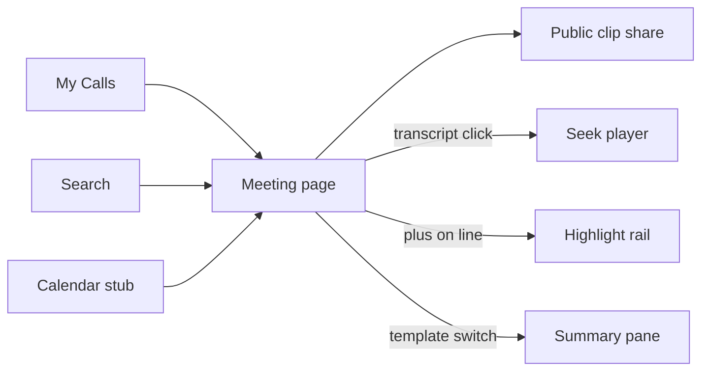

# Session Log - 2026-09-20

Session: `1297fe50` | Project: `8x-assignment` | Author: `ibrahimbutt`

---

[LOG_ENTRY type=PROMPT num=1 session=1297fe50]
timestamp: 2026-09-20T06:24:46.256Z
model: cursor-grok-4.6-high-fast

CAPTURE TEST — 8x assignment, Muhammad Ibrahim

[LOG_ENTRY type=RESPONSE num=1 session=1297fe50]
timestamp: 2026-09-20T06:25:04.417Z
model: cursor-grok-4.6-high-fast

**CAPTURE TEST PASS (session 1)** — Muhammad Ibrahim.

The prompt is in `.agent-logs/2026-09-20_06-24-46_1297fe50-7097-4685-92298de1488f.md` as:

```
[LOG_ENTRY type=PROMPT num=1 session=1297fe50]
timestamp: 2026-09-20T06:24:46.256Z
model: cursor-grok-4.6-high-fast

CAPTURE TEST — 8x assignment, Muhammad Ibrahim
```

This reply is the matching response. When the turn ends, `afterAgentResponse` / `stop` should append it automatically.

**Next:** open a **new** Agent chat in this same `8x-assignment` repo (not this thread) and send:

`CAPTURE TEST 2 — 8x assignment, Muhammad Ibrahim`

That proves the hook is not session-local. I will then write `CAPTURE-TEST.md` and commit the logs. No Fathom work until that second canary lands.

[LOG_ENTRY type=PROMPT num=2 session=1297fe50]
timestamp: 2026-09-20T06:25:28.376Z
model: cursor-grok-4.6-high-fast

Rebuild a live product in 24 hours. Better than the original if you want.
That window is deliberately generous and we do not expect you to use all of it. The clock is tracked, never enforced.

The product
fathom.video — the AI meeting notetaker.

Start by using it. Sign up on the free plan and go through the flows properly, every one of them, end to end. Take screenshots as you go. Understand the product fully before you write any code.

At minimum that means: connect a calendar, get the notetaker into a real meeting (a two-minute call with yourself on Zoom, Meet or Teams is enough), let it record, then live with what comes out the other side. Watch the playback against the transcript. Read the AI summary, switch templates, pull the action items. Highlight a moment mid-call and see where it lands. Search across meetings. Share a clip with someone who was not on the call. Then look at what happens on an eight-person call that runs an hour, because that is the case that actually matters.

You do not have to make the recording bot work. Faking or stubbing the capture layer is a legitimate call — say so in the walkthrough and spend the time on what you decided matters more.

Before you write anything
Run through this so your agent captures its prompts and responses into the repository: 8x agent capture setup

It takes about ten minutes. Do not start building until the capture test passes, and commit the `.agent-logs/` directory as you go rather than in one lump at the end.

What you hand in
A live link. Deployed and open, not a localhost recording.
A public repository. With `.agent-logs/` committed in it.
A walkthrough. Loom or anything similar, five minutes at most, camera on. Put it in the walkthrough field.
Paste the live link and the repository into the links field, and label each one.

Seed it with real data. An empty meetings list tells us nothing about what you built.

How it is judged
Speed. How much working product you got to in the time.
Product judgement. What you chose to build first, and what you left out.
UX and UI. Whether the thing you shipped is good to use.
Before you send it
The live link opens for somebody who is not signed in as you.
The repository is public, and `.agent-logs/` is in it.
Your camera is on in the walkthrough, and it is under five minutes.


we are going to build this website check it out and make a plan to match its requirements we have 15 hours to build and ship it

[LOG_ENTRY type=RESPONSE num=2 session=1297fe50]
timestamp: 2026-09-20T06:27:09.031Z
model: cursor-grok-4.6-high-fast

Session 1 capture is working and committed. I have not started product code.

I went through Fathom’s marketing site, overview, pricing, and help center (call page, highlights, clips, templates, sharing). I did **not** complete a live Zoom signup — that needs your Google/Zoom login. The assignment also says stubbing capture is a legitimate call, and that is the call I would make.

---

## What Fathom actually is (the product, not the homepage)

Fathom is not “a video player with notes.” The loop is:

1. A meeting exists (calendar / bot / bot-free).
2. After the call you live in **one page**: player + speaker-labeled transcript + summary + action items + highlights.
3. You **click the transcript to seek**, add a highlight from a line, and **share a clip** with someone who was not there.
4. You **search across meetings** and land on the exact utterance.
5. Templates change the summary (General, BANT, standup, etc.).

The brief is right: a two-minute self-call is the happy path. The thing that actually matters is an **eight-person, hour-long** call — overlapping speakers, many action items, highlights buried at minute 41.

## Judgement: what we build vs leave out

**Build (this is the product):**

| Flow | Why |
|---|---|
| Seeded **My Calls** home | Empty list fails the brief |
| Meeting page: player + transcript **in sync** | Core Fathom interaction |
| AI summary + **switch templates** (precomputed, instant) | Required; no API dependency for judges |
| Action items with owners | Required |
| Highlight a moment → it appears in the rail | Required |
| Search across meetings → jump to timestamp | Required |
| **Public share clip** (`/s/[id]`) — no login | Required, and satisfies “opens for somebody who is not signed in as you” |
| One **58–62 min, 8-speaker** meeting as the hero seed | The case they said matters |
| Calendar stub + fake “live” 2-min recording | Shows the capture story without a bot |

**Stub (say so in the walkthrough):** Zoom/Meet/Teams recording bot, real calendar OAuth, live notetaker in a real call.

**Leave out:** CRM sync, Scorecards, Deal View, playlists, folders, SSO, Ask-Fathom LLM chat, Slack/HubSpot, iOS/desktop, bot-free capture modes. Those are Fathom’s moat and they will eat the 15 hours.

**Auth:** none. The live site is a public demo workspace. Judges open the URL and see meetings. Share links work in a private window.

## Name and look

Not a Fathom clone with stars and astronauts. Working name: **Quorum**.

Visual direction: dark, dense, editorial — closer to a film-reviewer than a SaaS dashboard. Distinct type, tight meeting page, no purple-gradient AI look.

## Stack (ship in 15 hours)

- **Next.js (App Router) + TypeScript + Tailwind** in `/Users/muhammadsaqib/8x-assignment`
- Seed as committed TypeScript/JSON (no database)
- Highlights created in the demo persist in `localStorage`
- **Vercel** for the live link
- Public **GitHub** repo with `.agent-logs/` committed as we go

Player: waveform + duration. The hour-long call does **not** need a 60-minute video file — timestamps on the transcript are the product. A short 2-minute meeting can have a real audio file.



## 15-hour sequence

1. **Capture close-out (15–30 min)** — second-session canary + `CAPTURE-TEST.md`. Do this before UI code.
2. **Scaffold + design tokens (1.5h)**
3. **Seed 7 meetings (2h)** including the 8-person hour call, a 2-min 1:1, a sales discovery (BANT summary), a standup, a customer call. Precompute 3 templates per meeting.
4. **Home + search (1.5h)**
5. **Meeting page (3h)** — the whole grade lives here
6. **Templates + action items (1.5h)**
7. **Highlights + public clip page (2h)**
8. **Calendar stub + fake live capture (1h)**
9. **Polish + mobile (1h)**
10. **GitHub public + Vercel (45 min)**
11. **Walkthrough script for your 5-min camera-on Loom (30 min)** — I cannot turn your camera on; you record that last.

## Honest gaps from this recon

- I used fathom.ai / help.fathom.video, not a logged-in My Calls account.
- If you want, we can still sign up on the free plan with your Google account before coding. It would improve fidelity; it is not required to ship, given the stub-capture allowance.

---

**Still blocking the build:** open a **new** Agent chat in this same repo and send:

`CAPTURE TEST 2 — 8x assignment, Muhammad Ibrahim`

Then say **go** (or tweak the plan: name, auth, real Fathom signup). I will not write product code until that second canary lands and `CAPTURE-TEST.md` is in the repo.

[LOG_ENTRY type=PROMPT num=3 session=1297fe50]
timestamp: 2026-09-20T06:28:34.579Z
model: cursor-grok-4.6-high-fast

[LOG_ENTRY type=PROMPT num=1 session=baf18b67]
timestamp: 2026-09-20T06:27:32.475Z
model: cursor-grok-4.6-high-fast

CAPTURE TEST 2 — 8x assignment, Muhammad Ibrahim

